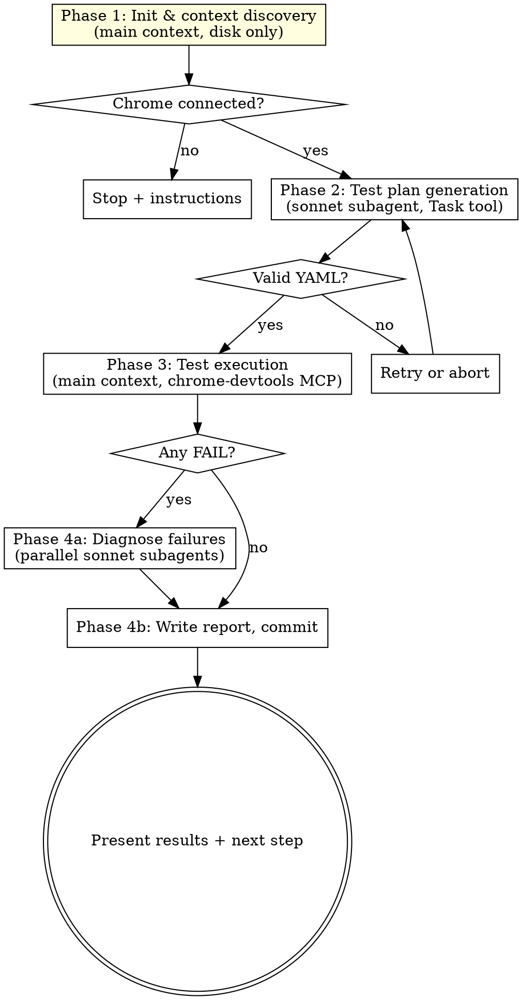

# bonsai-verify-ui Implementation Plan

> **For agentic workers:** REQUIRED SUB-SKILL: Use superpowers:subagent-driven-development (recommended) or superpowers:executing-plans to implement this plan task-by-task. Steps use checkbox (`- [ ]`) syntax for tracking.

**Goal:** Ship `bonsai-verify-ui`, an optional Tier 3 skill that runs after subagent-driven-development completes, verifies the resulting UI in a real browser via Chrome DevTools MCP in a fresh `/clear`ed session, and produces a diagnosis report — plus a minimal Tier 2 breadcrumb in `subagent-driven-development` that points users to it.

**Architecture:** Tier 3 skill at `skills/bonsai-verify-ui/` with two reference files. Runs in a fresh session, loads context from disk (git branch + spec + plan + git diff), spawns a sonnet subagent to generate a YAML test plan, executes it via `mcp__chrome-devtools__*` tools in the main context, spawns parallel sonnet subagents to diagnose failures, writes a markdown report to `docs/superpowers/verify/`. Plus a single Tier 2 edit to `skills/subagent-driven-development/SKILL.md` (one new optional section + one flowchart node + one integration line + one marker comment) and a manifest entry in `docs/bonsai/tier-2-edits.md`.

**Tech Stack:** Markdown (skill files); Chrome DevTools MCP server (assumed configured in the consuming project, tool names `mcp__chrome-devtools__*`); Claude Code orchestrator tools (`Task`, `Bash`, `Read`, `Grep`, `Glob`, `Write`, `AskUserQuestion`).

**Required Skills:** `superpowers:writing-skills` (Tier 1 canonical rules for skill frontmatter + body structure, description=trigger-not-summary, max 1024 char frontmatter), `superpowers:verification-before-completion` (the final smoke test must actually run — no "it should work" claims).

**Spec:** `docs/superpowers/specs/2026-04-15-bonsai-verify-ui-design.md` — authoritative reference for every content decision below. Several tasks say "copy verbatim from spec section X" — the spec is a committed, stable input that has the exact text already; re-paraphrasing would introduce drift.

---

## File Structure

**New files (Tier 3 skill):**
- `skills/bonsai-verify-ui/SKILL.md` — orchestrator body, frontmatter + 4 phase sections
- `skills/bonsai-verify-ui/test-planner-agent.md` — sonnet subagent protocol with mandatory coverage requirements
- `skills/bonsai-verify-ui/chrome-devtools-execution-patterns.md` — assertion-type → MCP tool lookup table

**Edited files (Tier 2 breadcrumb):**
- `skills/subagent-driven-development/SKILL.md` — add marker + "Optional Runtime Verification" section + dashed flowchart node + integration entry
- `docs/bonsai/tier-2-edits.md` — append manifest entry

**NOT touched:**
- Any Tier 1 skill
- `skills/subagent-driven-development/implementer-prompt.md`, `spec-reviewer-prompt.md`, `code-quality-reviewer-prompt.md`
- `skills/writing-plans/SKILL.md`, `skills/brainstorming/SKILL.md`
- `.mcp.json` or any MCP configuration

---

## Task 1: Scaffold skill directory and write `chrome-devtools-execution-patterns.md`

**Files:**
- Create: `skills/bonsai-verify-ui/chrome-devtools-execution-patterns.md`

This task creates the directory structure and the simplest reference file first — a pure lookup table with no dependencies on other files.

- [ ] **Step 1: Create the directory**

```bash
mkdir -p skills/bonsai-verify-ui/references
```

Verify: `ls -la skills/bonsai-verify-ui/` returns an empty directory.

- [ ] **Step 2: Write `chrome-devtools-execution-patterns.md`**

Create `skills/bonsai-verify-ui/chrome-devtools-execution-patterns.md` with this exact content:

```markdown
# Chrome DevTools Execution Patterns

Mechanical reference for the `bonsai-verify-ui` orchestrator during test execution (Phase 3).
This is a lookup table — not an agent protocol — for the main Claude Code context running
the test plan against a connected Chrome via the Chrome DevTools MCP server.

---

## Connection Check

Run once before any tests:

```
mcp__chrome-devtools__list_pages
```

**Pages returned:** Chrome is connected.
  - If one page URL matches `base_url`: call `mcp__chrome-devtools__select_page` with that page's id.
  - If no page matches `base_url`: call `mcp__chrome-devtools__new_page` with the base URL.
**Error / empty list:** Chrome not connected. Stop and ask the user to:
  1. Start dev server (`npm run dev` / `pnpm dev` / project-specific)
  2. Start Chrome with `--remote-debugging-port=9222`
  3. Re-run the skill in this same session

Never proceed with runtime tests if Chrome isn't connected. There is no "static-only" fallback
in this skill by design.

---

## Auth Setup

If the test plan has `auth.required: true`, run this sequence once before the first
auth-required test (not per-test):

1. `mcp__chrome-devtools__navigate_page` to `auth.login_url`
2. `mcp__chrome-devtools__wait_for` the `auth.email_selector` (5s timeout)
3. `mcp__chrome-devtools__fill` email selector with `auth.credentials.email`
4. `mcp__chrome-devtools__fill` password selector with `auth.credentials.password`
5. `mcp__chrome-devtools__click` submit selector
6. `mcp__chrome-devtools__wait_for` the `auth.success_indicator` (5s timeout)
7. If success indicator not found after 5s: mark auth as FAILED. Every test with
   `requires_auth: true` is SKIPPED with reason `"auth setup failed"`. Tests with
   `requires_auth: false` still run.

Auth state persists across tests (same browser session).

---

## Assertion Type Mapping

| Assertion type | Chrome DevTools MCP tool | How to check |
|---|---|---|
| `element_exists` | `take_snapshot` | Search DOM snapshot for selector. PASS if found. |
| `element_text` | `evaluate_script` | `document.querySelector('{selector}')?.textContent?.trim()` — check includes or matches expected |
| `element_value` | `evaluate_script` | `document.querySelector('{selector}')?.value` — check matches expected |
| `element_count` | `evaluate_script` | `document.querySelectorAll('{selector}').length` — check matches expected count |
| `element_visible` | `evaluate_script` | `getComputedStyle(el).display !== 'none' && getComputedStyle(el).visibility !== 'hidden'` |
| `navigation` | `evaluate_script` | `window.location.pathname` — check matches expected path |
| `url_contains` | `evaluate_script` | `window.location.href.includes('{expected}')` |
| `network_call` | `list_network_requests` | Filter requests by URL pattern. PASS if at least one match. |
| `no_console_errors` | `list_console_messages` | Filter for error-level messages, apply noise filter, PASS if none remain |
| `visual` | `take_screenshot` | No automated check. Capture screenshot, always PASS, flag for human review |

### evaluate_script patterns

**Text content check:**
```javascript
(() => {
  const el = document.querySelector('{selector}');
  return el ? el.textContent.trim() : null;
})()
```

**Navigation check:**
```javascript
window.location.pathname
```

**Element count:**
```javascript
document.querySelectorAll('{selector}').length
```

**Visibility check:**
```javascript
(() => {
  const el = document.querySelector('{selector}');
  if (!el) return false;
  const style = getComputedStyle(el);
  return style.display !== 'none' && style.visibility !== 'hidden';
})()
```

---

## Setup Action Mapping

| Plan action | Chrome DevTools MCP tool | Parameters |
|---|---|---|
| `click` | `mcp__chrome-devtools__click` | `selector` |
| `fill` | `mcp__chrome-devtools__fill` | `selector`, `value` |
| `press_key` | `mcp__chrome-devtools__press_key` | `key` |
| `hover` | `mcp__chrome-devtools__hover` | `selector` |

After each setup action, pause 500ms or call `wait_for` the next expected selector.

---

## Evidence Collection

**Every test:** `mcp__chrome-devtools__take_screenshot` after the last assertion completes
(pass or fail). Store the returned resource URI in the test result.

**On FAIL additionally collect:**
- `mcp__chrome-devtools__list_console_messages` — filter to recent messages since test started
- `mcp__chrome-devtools__list_network_requests` — filter to recent requests, keep 4xx/5xx

Store these in the test result for the report and for the diagnosis subagent's input.

---

## Error Recovery

**MCP tool failure (transient error, timeout):**
1. Wait 2 seconds
2. Retry the exact same tool call once
3. If retry also fails: mark current assertion FAIL with error details, continue to next
   assertion in the same test

**Three consecutive test FAIL results:**
1. Stop executing further tests
2. Mark remaining tests SKIP with reason `"stopped after 3 consecutive failures"`
3. Proceed to Phase 4 with whatever results are in hand

**Navigation failure (page doesn't load, timeout):**
1. Verify Chrome is still connected: `mcp__chrome-devtools__list_pages`
2. If no pages: stop execution, ask user to restart dev server
3. If pages exist but URL failed: mark test FAIL with error, continue to next test

**Selector not found:**
1. Take a `mcp__chrome-devtools__take_snapshot` to capture current DOM state as evidence
2. Mark assertion FAIL with `"selector not found: {selector}"`
3. Continue to next assertion in the same test

---

## Dependency Skip Logic

Before each test, check `depends_on`:

```
for dep_id in test.depends_on:
  if TEST_RESULTS[dep_id].status == "FAIL":
    mark test as SKIP with reason: "Depends on test #{dep_id} which failed"
    break
```

Only skip for FAIL, not for SKIP. This prevents cascading skips from a single root failure.

---

## Console Message Filtering

When checking `no_console_errors`, ignore:

- React development warnings (`Warning:`, `You are running React in development mode`)
- Hot module reload messages (`[HMR]`, `[Fast Refresh]`)
- Favicon 404 (`GET /favicon.ico 404`)
- Source map warnings (`DevTools failed to load source map`)

**Never ignore:**

- Next.js hydration mismatch warnings — these usually indicate real bugs
- Any `console.error(...)` call originating from app code
- Uncaught exceptions
- Failed `fetch`/XHR responses (4xx, 5xx, network errors)
```

- [ ] **Step 3: Verify the file exists and has the expected structure**

Read the file back and confirm:
- Has H1 `# Chrome DevTools Execution Patterns`
- Has sections: `Connection Check`, `Auth Setup`, `Assertion Type Mapping`, `Setup Action Mapping`, `Evidence Collection`, `Error Recovery`, `Dependency Skip Logic`, `Console Message Filtering`
- The assertion type table lists all 10 assertion types (`element_exists`, `element_text`, `element_value`, `element_count`, `element_visible`, `navigation`, `url_contains`, `network_call`, `no_console_errors`, `visual`)
- Every MCP tool referenced uses the full `mcp__chrome-devtools__*` prefix

Run:

```bash
grep -c "mcp__chrome-devtools__" skills/bonsai-verify-ui/chrome-devtools-execution-patterns.md
```

Expected: at least 15 matches.

- [ ] **Step 4: Commit**

```bash
git add skills/bonsai-verify-ui/chrome-devtools-execution-patterns.md
git commit -m "feat(bonsai-verify-ui): add chrome-devtools execution patterns reference"
```

---

## Task 2: Write `test-planner-agent.md`

**Files:**
- Create: `skills/bonsai-verify-ui/test-planner-agent.md`

This is the protocol that a sonnet subagent reads to generate the YAML test plan. Adapted from the spec's Phase 2 section, with mandatory coverage requirements and a coverage audit step.

- [ ] **Step 1: Write `test-planner-agent.md`**

Create `skills/bonsai-verify-ui/test-planner-agent.md` with this exact content:

````markdown
# Test Planner Agent Protocol

You are a test planner subagent spawned by the `bonsai-verify-ui` orchestrator. You explore
what was built on a feature branch and generate a structured YAML test plan for Chrome DevTools
runtime testing.

**CRITICAL: Read all files in the `<files_to_read>` block FIRST before any other action.**

**Output: Return ONLY a `<test_plan>` YAML block. No prose, no explanations, no other output.
The orchestrator parses this block directly and discards everything outside it.**

---

## Step 1: Load Context

Read every file listed in the `<files_to_read>` block from the orchestrator prompt:

- The spec file (intent, requirements, acceptance criteria)
- The plan file (what was built, tech stack, task list, required skills)
- `./CLAUDE.md` if it exists (project conventions, test URLs, credential hints)

Read the `<context>` block for:
- Branch name, base URL, auth hint, list of changed files (from `git diff`)

## Step 2: Explore What Was Built

For each file in the `<context>.changed_files` list:

1. Read the file with the Read tool
2. Grep for `data-testid="..."` attributes — record these as preferred selectors
3. Grep for `aria-label="..."` attributes — second-choice selectors
4. Identify semantic HTML elements (`<button>`, `<input type="email">`, `<form>`, `<h1>`, etc.)
5. If the file is a page/route, record its URL path
6. If the file is a component, record the page(s) that import it
7. If the file is an API endpoint, record the HTTP method + path

Use Grep and Glob to find:

- Route files: `src/app/**/page.tsx`, `src/pages/**/*.tsx`, `app/**/page.tsx`
- Components: `src/components/**/*.tsx`
- API endpoints: grep for `export.*GET|POST|PUT|DELETE|PATCH` and `@Controller|@Get|@Post`

Filter results to files that are in `<context>.changed_files` or that import files in it.

## Step 3: Map Routes

Build an in-memory route map from the discovered files:

```yaml
routes:
  - path: /dashboard
    source: src/app/dashboard/page.tsx
    auth_required: true
  - path: /login
    source: src/app/login/page.tsx
    auth_required: false
```

A route is `auth_required: true` if its source file (or any middleware/layout that wraps it)
references an auth guard, session check, or redirect-to-login.

## Step 4: Determine Auth Requirements

1. Check route files for auth middleware, guards, session checks, `getSession`, `useSession`,
   `withAuth` wrappers, `@UseGuards(AuthGuard)`, or equivalent
2. Check for a login page / auth flow component in the codebase
3. Look for test credentials in this order:
   - `.env.test`, `.env.local`, `.env.development`
   - `./CLAUDE.md` (search for TEST_USER, TEST_EMAIL, test credentials)
   - Seed files (`prisma/seed.ts`, `db/seed.sql`, fixtures)
4. If auth is needed AND credentials found: fill the `auth` section in the YAML plan
5. If auth is needed BUT no credentials found: emit the `auth` section with `required: true` and
   a comment `# WARNING: no test credentials found — auth-required tests will be skipped`.
   The executor will handle this.

## Step 5: Derive Test Scenarios — Mandatory Coverage

**No test budget.** Cover every changed surface and every edge case. The goal is exhaustive
runtime coverage, not a smoke test.

For every page, component, or interactive surface in the changed files, the plan MUST include:

### Happy path
Every new or modified user-facing surface needs a test that walks the primary successful flow.
If a task "added a new project form," the plan has a "new project form — happy path" test that
fills valid values, submits, and verifies the success outcome.

### Validation failures
For every form field that has visible constraints (required, type, min/max, regex, custom
validator), include a test that submits invalid input and verifies the error appears.

- Required field empty → error element exists
- Wrong type (text in number field) → error element exists
- Out of range (length, min, max) → error element exists
- Regex mismatch (invalid email, etc.) → error element exists

One test per constraint. If a form has 5 fields with 2 constraints each, that's up to 10
validation tests (de-dupe where constraint semantics are truly identical, but prefer more tests
over fewer).

### Empty states
For every list, table, or collection that can legitimately be empty, include a test that loads
the page in its empty state and verifies the empty-state UI renders (zero results message, empty
search prompt, "create your first X" call to action, etc.).

### Auth boundaries
For every `auth_required: true` route:
- A test as an unauthenticated user (no auth setup run before it) that verifies the expected
  denial (redirect to login, 401 page, empty state)
- A test as an authenticated user that verifies the protected content renders

Skip this bucket entirely if the project has no auth.

### Error states
For every observable failure mode where the UI renders an error message:
- Invalid server response (4xx, 5xx)
- Network failure (if easily triggerable via the UI — otherwise skip)
- Validation server error (different from client-side validation; test that the error is
  displayed when the server returns it)

## Step 6: Coverage Audit

Before returning the YAML block, walk each file in `<context>.changed_files` and confirm:

- The file is referenced by at least one test (via its URL/route, via a selector whose source
  is in the file, via a form field that maps to it, via an API endpoint the test hits), OR
- The file is listed in `untestable_files:` with an explicit reason

**Acceptable untestable reasons:**
- "Backend-only file, no UI surface" (e.g., `src/services/logger.ts`)
- "Database migration, no UI surface" (e.g., `prisma/migrations/...`)
- "Config/schema file with no UI surface" (e.g., `tsconfig.json`, `next.config.js`)
- "Build tooling" (e.g., `vite.config.ts`, `webpack.config.js`)
- "Documentation" (e.g., `README.md`, `docs/**`)

**Un-acceptable untestable reasons:**
- "Hard to test"
- "No selectors"
- "Unsure how to test"
- "Untestable" (without a specific reason)

If a changed file has no test and can't be justifiably marked untestable, go back to Step 5 and
add a test for it.

## Step 7: Select Selectors

For each test action and assertion, use selectors in this priority order, grepping the actual
source of the file under test:

1. `data-testid="..."` — most reliable, grep first
2. `aria-label="..."` — accessible and stable
3. `role="..." + name` — semantic and accessible
4. Semantic HTML — `button`, `input[type="email"]`, `h1`, `nav a`, `form[action="..."]`
5. CSS class — last resort, fragile

**Never use:**
- Generated class names (CSS-module hashes, Tailwind utility selectors)
- Positional selectors (`nth-child`, `first-of-type`)
- XPath

The planner grep the actual source files — it does not guess selectors. If no acceptable
selector exists in the source, the planner either (a) chooses a stable semantic fallback and
notes it in the test's `expected` description, or (b) marks the file `untestable` with reason
"no stable selectors available."

## Step 8: Generate Test Plan

Output a single `<test_plan>` block with this YAML structure:

```yaml
<test_plan>
base_url: http://localhost:3000

auth:
  required: false
  # If required: true, include:
  # login_url: /login
  # credentials:
  #   email: test@example.com
  #   password: testpassword
  # email_selector: input[type="email"]
  # password_selector: input[type="password"]
  # submit_selector: button[type="submit"]
  # success_indicator: "[data-testid='dashboard']"

tests:
  - id: 1
    name: "Dashboard loads with project list"
    url: /dashboard
    requires_auth: true
    depends_on: []
    wait_for: "[data-testid='project-list']"
    setup_actions: []
    assertions:
      - type: element_exists
        selector: "[data-testid='project-list']"
        expected: "Project list container is present"
      - type: element_text
        selector: h1
        expected: "Dashboard"
      - type: no_console_errors
        expected: "No JavaScript errors in console"

  - id: 2
    name: "New project form — happy path"
    url: /projects/new
    requires_auth: true
    depends_on: [1]
    wait_for: "form"
    setup_actions:
      - tool: fill
        selector: "input[name='title']"
        value: "Test Project"
      - tool: fill
        selector: "textarea[name='description']"
        value: "Test description"
      - tool: click
        selector: "button[type='submit']"
    assertions:
      - type: navigation
        expected: "/projects/"
      - type: element_text
        selector: "[data-testid='success-message']"
        expected: "Project created"

  - id: 3
    name: "New project form — validation failure on empty title"
    url: /projects/new
    requires_auth: true
    depends_on: [1]
    wait_for: "form"
    setup_actions:
      - tool: click
        selector: "button[type='submit']"
    assertions:
      - type: element_exists
        selector: "[data-testid='error-title-required']"
        expected: "Validation error for missing title"

untestable_files:
  - path: prisma/migrations/20260415_add_project.sql
    reason: "Database migration, no UI surface"
</test_plan>
```

### YAML field requirements

Per-test:
- `id` (int, monotonically increasing from 1)
- `name` (str, human-readable)
- `url` (relative path, starts with `/`, no `http://`)
- `requires_auth` (bool, true if URL is under auth-protected route tree)
- `depends_on` (list of ids, may be empty)
- `wait_for` (selector string or null)
- `setup_actions` (list, may be empty)
- `assertions` (list, at least 1)

Per-assertion:
- `type` (one of the 10 known types in `chrome-devtools-execution-patterns.md`)
- `selector` (when the type needs one)
- `expected` (string description of the expected outcome)

## Step 9: Validate

Before returning, verify:

- [ ] Every changed file is covered by at least one test OR listed in `untestable_files`
- [ ] Every test has at least one assertion
- [ ] Every URL is a relative path (no `http://`, no `https://`)
- [ ] Every selector follows the priority order (no XPath, no positional, no generated classes)
- [ ] Every test has a `requires_auth` field
- [ ] `depends_on` reflects actual dependencies (a form submission test depends on the page's load test)
- [ ] The plan includes happy path, validation failures, empty states, auth boundaries
      (if auth exists), and error states
- [ ] No test is redundant (identical assertions on identical URLs with no meaningful difference)

## Output Format

Return ONLY a `<test_plan>` YAML block. No prose before or after. No explanations. No markdown
headers outside the block.

The orchestrator parses the block directly. Any text outside the block is discarded.
````

- [ ] **Step 2: Verify the file exists and has the expected structure**

Read the file back and confirm:
- Has H1 `# Test Planner Agent Protocol`
- Has sections: Step 1 through Step 9
- Step 5 has sub-headers: "Happy path", "Validation failures", "Empty states", "Auth boundaries", "Error states"
- Step 6 has both "Acceptable untestable reasons" and "Un-acceptable untestable reasons" lists
- The YAML example has `requires_auth` on every test

Run:

```bash
grep -c "^### " skills/bonsai-verify-ui/test-planner-agent.md
```

Expected: at least 5 (the 5 coverage sub-headers in Step 5).

```bash
grep "requires_auth:" skills/bonsai-verify-ui/test-planner-agent.md | wc -l
```

Expected: at least 3 (appears in the 3 example tests in the YAML block).

- [ ] **Step 3: Commit**

```bash
git add skills/bonsai-verify-ui/test-planner-agent.md
git commit -m "feat(bonsai-verify-ui): add test planner agent protocol"
```

---

## Task 3: Write `SKILL.md`

**Files:**
- Create: `skills/bonsai-verify-ui/SKILL.md`

This is the skill's orchestrator body. It references both files from Task 1 and Task 2. The frontmatter is trigger-only (not a summary — the CSO warning from `writing-skills` applies).

- [ ] **Step 1: Write `SKILL.md`**

Create `skills/bonsai-verify-ui/SKILL.md` with this exact content:

````markdown
---
name: bonsai-verify-ui
description: Use when runtime-verifying a web UI in a fresh /clear'ed session after subagent-driven-development completes on a feature branch, or when the user says "verify work", "verify this branch", "runtime test the UI", "verify UI". Do NOT use for backend-only changes, static verification, or when a dev server + Chrome DevTools MCP aren't available.
---

# bonsai-verify-ui

Runtime UI verification for work completed by `superpowers:subagent-driven-development`. Runs
in a fresh `/clear`ed session, reads spec + plan + git diff from disk, spawns a sonnet subagent
to generate a YAML test plan, executes the plan via Chrome DevTools MCP in the main context,
diagnoses failures via parallel sonnet subagents, and writes a report to
`docs/superpowers/verify/`.

**Core principle:** fresh session + disk-only inputs + main-context browser control = verification
that is independent of whatever the implementer believed they built. The browser must be driven
by exactly one agent (the main orchestrator) to avoid parallel-agent contention documented in
Chrome's 2026 multi-agent guidance.

**No auto-fix.** Verification exposes problems and diagnoses root causes. The human decides the
next step (debug manually, re-dispatch to a fix pass, revert).

## When to Use

- After `superpowers:subagent-driven-development` completes its final code reviewer pass and
  the user `/clear`s the session, before `superpowers:finishing-a-development-branch`
- User says "verify work", "verify this branch", "runtime test the UI", "verify UI"
- The feature branch has a web UI that can be opened in Chrome

**When NOT to use:**
- Backend-only changes with no user-observable UI
- Pure refactors with no behavior change
- Docs-only or config-only edits
- Static verification (typecheck, lint, tests) — those ran during subagent-driven-development
- When the dev server isn't running or Chrome DevTools MCP isn't configured

## Skill References

- `test-planner-agent.md` — protocol for the sonnet test-planner subagent
- `chrome-devtools-execution-patterns.md` — assertion-type → MCP tool lookup table

Both files are read at runtime:
- `test-planner-agent.md` is passed to the sonnet subagent via `<files_to_read>` in Phase 2
- `chrome-devtools-execution-patterns.md` is read by the main orchestrator in Phase 3

## The Process



## Phase 1: Init & Context Discovery

Runs entirely in the main orchestrator context using Bash, Read, Grep, Glob, and
`mcp__chrome-devtools__list_pages`.

1. **Branch check.** Run `git branch --show-current`. If the result is `main` or `master`, stop
   and tell the user to run the skill from the feature branch the implementation landed on.
   Never verify on the main branch.

2. **Commit range.** Run `git log main..HEAD --name-only --pretty=format:'%H%n%s%n%b%n---'`.
   Parse into `{sha, subject, body, files[]}` records.

3. **Plan/spec grep.** Across all commit subjects and bodies, regex-match
   `docs/superpowers/plans/[^ ]+\.md` and `docs/superpowers/specs/[^ ]+-design\.md`. Collect
   unique matches.

4. **Resolve ambiguity.**
   - Zero matches → fall back to "ask mode"
   - Exactly one match of each → proceed with those paths
   - Multiple matches → fall back to "ask mode"

5. **Ask fallback (only if needed).** Use `AskUserQuestion`. Build candidates:
   - `Glob('docs/superpowers/plans/*.md')` sorted by mtime descending, top 5
   - `Glob('docs/superpowers/specs/*-design.md')` sorted by mtime descending, top 5
   Present as a single multi-choice question with `{spec_path, plan_path}` pairs. User picks one.

6. **Read artifacts into context:**
   - Read the full text of `{spec_path}` and `{plan_path}`
   - Read `./CLAUDE.md` if it exists
   - Run `git diff main...HEAD --stat` and parse the file list

7. **Base URL detection.** Scan the plan body and `CLAUDE.md` for `localhost:\d+` patterns. Take
   the most frequent match. Default to `http://localhost:3000` if none found. Print one line
   to the user: `"Detected base URL: {url}. Press enter to accept or type a different URL."`
   Wait for the response and use whatever the user says.

8. **Chrome connection precheck.** Call `mcp__chrome-devtools__list_pages`:
   - **Pages returned, one matches `base_url`** → call `mcp__chrome-devtools__select_page` with
     that page's id
   - **Pages returned, none match** → call `mcp__chrome-devtools__new_page` with `url=base_url`
   - **Empty list or MCP error** → stop execution and print:
     ```
     Chrome DevTools MCP not connected. To proceed:
       1. Start your dev server (npm run dev / pnpm dev)
       2. Start Chrome with: chrome --remote-debugging-port=9222
       3. Re-run this skill in this same session
     ```
     Do not proceed without a connection.

**Output of Phase 1:** in-memory context object:
```
{ branch, spec_path, plan_path, changed_files, commit_range, base_url,
  connected_page_id, auth_hint }
```

Nothing is written to disk in Phase 1.

## Phase 2: Test Plan Generation

Spawn one sonnet subagent via the `Task` tool. The subagent reads the test planner protocol,
the spec, the plan, and `CLAUDE.md`, explores the source tree for changed files, and returns
a `<test_plan>` YAML block. The subagent has no chrome-devtools access — it only reads files
and returns YAML.

**Dispatch prompt:**

```
Task tool (general-purpose):
  description: "Generate runtime test plan for bonsai-verify-ui"
  model: sonnet
  prompt: |
    <objective>
    Explore what was built on branch {branch} and generate a <test_plan> YAML block for
    Chrome DevTools runtime testing. Return ONLY the YAML block, no prose.
    </objective>

    <agent_instructions>
    Read and follow the test planner protocol:
    skills/bonsai-verify-ui/test-planner-agent.md
    </agent_instructions>

    <context>
    Branch: {branch}
    Spec:   {spec_path}
    Plan:   {plan_path}
    Base URL: {base_url}
    Auth hint: {auth_hint or "none detected"}
    Changed files (from git diff):
      {list of paths, one per line}
    </context>

    <files_to_read>
    - skills/bonsai-verify-ui/test-planner-agent.md
    - {spec_path}
    - {plan_path}
    - ./CLAUDE.md  (skip if not present)
    </files_to_read>
```

**Parse and validate the returned `<test_plan>` block.** Reject with retry if:

- The YAML is syntactically invalid
- Any test is missing `id`, `name`, `url`, `requires_auth`, or `assertions`
- Any assertion is missing `type` or `expected`
- Any URL contains `http://` or `https://` (must be relative)
- Any selector uses `nth-child`, XPath, or CSS-module hash patterns
- Any file in `<context>.changed_files` is absent from both `tests[].url`/selector references
  and `untestable_files`

On retry (max 2), re-dispatch the subagent with an appended note explaining what failed. After
two retries, warn the user and offer: `proceed with partial plan`, `switch to interactive mode
where user describes tests`, `abort`.

## Phase 3: Test Execution

Main context runs the test plan. Deterministic loop over tests, no model calls, no subagents.
All tool calls are `mcp__chrome-devtools__*`.

**Read `chrome-devtools-execution-patterns.md` at the start of this phase** — it is
the lookup table for everything this phase does.

**Per-test flow:**

1. **Dependency skip** — if any `depends_on` id has status FAIL, mark this test SKIP
2. **Auth setup if needed** — if `test.requires_auth: true` AND auth setup has not yet run AND
   `auth.required: true` in the plan, run the auth setup sequence from
   `chrome-devtools-execution-patterns.md § Auth Setup`. If auth setup fails, mark this test
   and all subsequent auth-required tests SKIP with reason `"auth setup failed"`.
3. **Navigate** — `mcp__chrome-devtools__navigate_page(base_url + test.url)`
4. **Wait** — `mcp__chrome-devtools__wait_for(test.wait_for)` with 5s timeout, or 2s pause if
   `wait_for` is null
5. **Setup actions** — for each action in `test.setup_actions`, call the matching
   `mcp__chrome-devtools__*` tool from the Setup Action Mapping table. 500ms pause after each.
6. **Assertions** — for each assertion, use the Assertion Type Mapping table to call the right
   tool and evaluate the result
7. **Evidence** — `mcp__chrome-devtools__take_screenshot`. On FAIL, also
   `list_console_messages` + `list_network_requests`.
8. **Record** — append to `TEST_RESULTS` array with `{id, name, url, status, assertions,
   evidence_uri, console_errors?, failed_requests?}`
9. **Progress** — print one line to the user: `Test {i}/{N}: {name} — {PASS|FAIL|SKIP}`

**Error recovery** is defined in `chrome-devtools-execution-patterns.md § Error Recovery`. Key
rules:
- MCP tool failure → wait 2s, retry once, then mark FAIL and continue
- 3 consecutive test FAILs → stop execution, mark rest SKIPPED, proceed to Phase 4
- Navigation timeout → mark FAIL, continue
- Selector not found → take snapshot as evidence, mark assertion FAIL, continue

**Console noise filter** is defined in `chrome-devtools-execution-patterns.md § Console
Message Filtering`. Never ignore hydration warnings, `console.error` from app code, or failed
`fetch` responses.

## Phase 4: Report & Failure Diagnosis

### 4a. Diagnose failures (only if any test FAILED)

For each FAIL test, dispatch a sonnet subagent **in parallel** via a single message with
multiple `Task` calls. Parallel dispatch is required — N failing tests must not serialize.

**Diagnosis subagent prompt:**

```
Task tool (general-purpose):
  description: "Diagnose failure: {test.name}"
  model: sonnet
  prompt: |
    Diagnose the root cause of this test failure. You must NOT implement the fix — only
    identify what's wrong and where. Return exactly these fields as YAML:

      root_cause: one concise sentence
      affected_files:
        - path: file.ts
          line: 42
      suggested_fix: one concise sentence describing the human fix approach

    Test: {test.name}
    URL: {test.url}
    Expected: {test.expected}
    Failed assertions: {details}
    Console errors: {list}
    Failed network requests: {list}

    Context:
    - Spec: {spec_path}
    - Plan: {plan_path}
    - Changed files on this branch: {list}

    Start by reading the spec and plan to understand intent, then read the changed files
    referenced in the failure to identify the root cause.
```

Merge each subagent's return values into the corresponding test entry. If a diagnosis subagent
returns unstructured output, record `root_cause: "diagnosis failed, see raw output"` and save
the raw response — do not block the report on a bad diagnosis.

### 4b. Write report

**Report path:** `docs/superpowers/verify/YYYY-MM-DD-<topic>-verify.md`

**Topic derivation:**
1. Take the plan basename without `.md` (e.g., `2026-04-15-user-auth`)
2. Strip any leading `YYYY-MM-DD-` date prefix (e.g., `user-auth`)
3. That's the topic

Create the `docs/superpowers/verify/` directory if it doesn't exist.

**Report structure:**

```markdown
---
status: complete
branch: {branch}
spec: {spec_path}
plan: {plan_path}
started: {ISO timestamp of Phase 1 start}
updated: {ISO timestamp now}
---

## Summary

total: {N}  passed: {N}  failed: {N}  skipped: {N}

## Coverage

changed_files: {count from git diff}
covered_files: {count}
untestable_files:
  - path: {path}
    reason: {reason}

## Tests

### 1. {Test Name}
- **url:** {url}
- **expected:** {description}
- **result:** pass
- **evidence:** Screenshot resource URI from take_screenshot

### 2. {Failing Test Name}
- **url:** {url}
- **expected:** {description}
- **result:** fail
- **failed_assertions:**
  - type: {type}
    selector: {selector}
    expected: {expected}
    actual: {actual}
- **console_errors:**
  - {each error on its own line}
- **failed_requests:**
  - {method} {url} → {status} {message}
- **evidence:** Screenshot resource URI
- **root_cause:** {from diagnosis subagent}
- **affected_files:**
  - {path}:{line}
- **suggested_fix:** {one-line approach}
```

### 4c. Commit the report

```bash
git add docs/superpowers/verify/{report_file}.md
git commit -m "verify: runtime UI verification for {topic}"
```

Do not skip hooks. Do not amend. Do not force-push.

### 4d. Present to user

Print a concise table:

```
## Verification Complete — {topic}

Runtime tests: {passed}/{total} passed

| # | Test | Result | Details |
|---|------|--------|---------|
| 1 | {name} | PASS | — |
| 2 | {name} | FAIL | {root cause} |
| 3 | {name} | SKIP | depends on #2 |

Report: docs/superpowers/verify/{file}.md
```

**All pass:**
```
✅ All tests passed. Ready to finish the branch.

Next: invoke superpowers:finishing-a-development-branch
```

**Any fail:**
```
⚠ {N} test(s) failed. Root causes diagnosed in the report.

Next steps (your choice):
- /clear + superpowers:systematic-debugging — dig into a specific failure
- /clear + superpowers:subagent-driven-development — hand the report to a fix pass
- Read the report and fix manually
```

## Red Flags

**Never:**
- Run this skill from `main` or `master` branch
- Proceed if Chrome DevTools MCP is not connected
- Dispatch multiple subagents that all need chrome-devtools access (only the main orchestrator
  drives the browser)
- Auto-fix failures (the skill diagnoses, the human decides)
- Amend or force-push the report commit
- Ignore hydration warnings or `console.error` from app code in the noise filter
- Skip the coverage audit — every changed file must be covered or justifiably untestable

## Integration

**Upstream:**
- `superpowers:subagent-driven-development` — implementation flow that hands off to this skill
  via an optional "Optional Runtime Verification" section after its final code reviewer approves

**Downstream:**
- `superpowers:finishing-a-development-branch` — next step after all tests pass
- `superpowers:systematic-debugging` — next step for investigating a specific failure
- `superpowers:subagent-driven-development` — rerun in a fix pass if the diagnosis surfaces
  fix-plan-worthy work
````

- [ ] **Step 2: Verify frontmatter is within the 1024 char limit**

```bash
awk '/^---$/{n++; next} n==1' skills/bonsai-verify-ui/SKILL.md | wc -c
```

Expected: value less than or equal to 1024. If over, tighten the description until it fits.

- [ ] **Step 3: Verify the file structure**

Read the file back and confirm:
- Frontmatter has only `name` and `description` — no `type`, `version`, `tags`, `model`
- Has sections: `When to Use`, `Skill References`, `The Process`, `Phase 1`, `Phase 2`, `Phase 3`, `Phase 4`, `Red Flags`, `Integration`
- References both `test-planner-agent.md` and `chrome-devtools-execution-patterns.md`
- DOT flowchart is present
- Description starts with "Use when" (trigger-only, not a summary of what the skill does)

Run:

```bash
grep -c "test-planner-agent.md" skills/bonsai-verify-ui/SKILL.md
```

Expected: at least 2.

```bash
grep -c "chrome-devtools-execution-patterns.md" skills/bonsai-verify-ui/SKILL.md
```

Expected: at least 2.

```bash
grep -c "mcp__chrome-devtools__" skills/bonsai-verify-ui/SKILL.md
```

Expected: at least 6.

- [ ] **Step 4: Commit**

```bash
git add skills/bonsai-verify-ui/SKILL.md
git commit -m "feat(bonsai-verify-ui): add orchestrator SKILL.md"
```

---

## Task 4: Tier 2 edit — breadcrumb in `subagent-driven-development/SKILL.md`

**Files:**
- Modify: `skills/subagent-driven-development/SKILL.md`

Four changes, covered by a single `<!-- BONSAI TIER-2 EDIT -->` marker comment. This is the entire Tier 2 footprint for this feature.

- [ ] **Step 1: Read the current file structure to locate insertion points**

Read `skills/subagent-driven-development/SKILL.md` and find:
- The DOT flowchart block (the `digraph process { ... }` one in the "The Process" section)
- The end of the `## Example Workflow` section
- The `## Integration` section at the bottom

- [ ] **Step 2: Add the DOT flowchart edit**

In the `digraph process { ... }` block, find these two lines:

```dot
    "More tasks remain?" -> "Dispatch final code reviewer subagent for entire implementation" [label="no"];
    "Dispatch final code reviewer subagent for entire implementation" -> "Use superpowers:finishing-a-development-branch";
```

Replace them with:

```dot
    "More tasks remain?" -> "Dispatch final code reviewer subagent for entire implementation" [label="no"];
    "Dispatch final code reviewer subagent for entire implementation" -> "Optional: /clear + invoke bonsai-verify-ui\n(runtime UI verification)" [style=dashed, color=gray50];
    "Optional: /clear + invoke bonsai-verify-ui\n(runtime UI verification)" [shape=box style=filled fillcolor=lightyellow];
    "Optional: /clear + invoke bonsai-verify-ui\n(runtime UI verification)" -> "Use superpowers:finishing-a-development-branch";
```

The new edge from the final code reviewer is `style=dashed, color=gray50` to visually mark it as optional. The new node is `fillcolor=lightyellow` (Bonsai convention for fork additions).

- [ ] **Step 3: Insert the "Optional Runtime Verification (Bonsai)" section**

Find the `## Example Workflow` section. After its closing content but before the `## Advantages` section, insert this block:

```markdown
<!-- BONSAI TIER-2 EDIT: "Optional Runtime Verification" section, corresponding DOT flowchart node (dashed edge + lightyellow fill), and Integration "Optional downstream" entry for bonsai-verify-ui. On upstream merge, ensure all three survive. -->

## Optional Runtime Verification (Bonsai)

After the final code reviewer approves and before finishing the branch, you MAY runtime-verify
the UI in a real browser. This is skippable for non-UI work (backend-only, config, docs), but
strongly recommended for any task that touches pages, components, forms, or user-facing flows.

**How:** `/clear` the current session (to drop all accumulated context), then in the fresh
session invoke the `bonsai-verify-ui` skill. It will read the spec, plan, and branch git log,
generate a test plan, execute it via Chrome DevTools MCP, and write a report to
`docs/superpowers/verify/`.

**Why /clear:** the verification runs in a fresh session with only disk state as input. This
avoids context pollution from the implementation flow and keeps the verification independent
of whatever the implementer believed they built.

**When to skip:** backend-only changes with no UI surface, pure refactors, docs-only edits,
config tweaks. Use your judgment — if a user could observe the change in a browser, verify it.
```

- [ ] **Step 4: Add the Integration entry**

Find the `## Integration` section at the bottom of the file. It has sub-sections `**Required workflow skills:**`, `**Subagents should use:**`, and `**Alternative workflow:**`. After `**Alternative workflow:**` (and its entry), add a new sub-section:

```markdown
**Optional downstream:**
- **bonsai-verify-ui** - Runtime UI verification in a fresh session after implementation completes. Invoke via /clear + skill trigger after the final code reviewer approves.
```

- [ ] **Step 5: Verify all four changes are in place**

Run:

```bash
grep -c "bonsai-verify-ui" skills/subagent-driven-development/SKILL.md
```

Expected: at least 5 (1 DOT node text mention, 2 in the new section, 1 in Integration entry, 1 in the marker comment).

```bash
grep -c "BONSAI TIER-2 EDIT" skills/subagent-driven-development/SKILL.md
```

Expected: 2 (one existing from the prior edit + the new one we just added). Confirm the new one is the Optional Runtime Verification marker by reading its text.

```bash
grep "Optional Runtime Verification" skills/subagent-driven-development/SKILL.md
```

Expected: 1 match (the section heading).

```bash
grep "Optional: /clear + invoke bonsai-verify-ui" skills/subagent-driven-development/SKILL.md
```

Expected: 3 matches (2 in the DOT block — the edge definition line + the node definition line + the outgoing edge — actually that's 3 occurrences of the node name as a string).

- [ ] **Step 6: Commit**

```bash
git add skills/subagent-driven-development/SKILL.md
git commit -m "feat(tier-2): add optional runtime verification breadcrumb

Adds the Bonsai bonsai-verify-ui breadcrumb to the subagent-driven-development
flow: a new Optional Runtime Verification section, a dashed flowchart edge to
a new lightyellow node, and an Integration 'Optional downstream' entry. All
wrapped in a single BONSAI TIER-2 EDIT marker for merge-conflict tracking."
```

---

## Task 5: Tier 2 manifest entry in `docs/bonsai/tier-2-edits.md`

**Files:**
- Modify: `docs/bonsai/tier-2-edits.md`

Append a new entry following the existing template. Dated 2026-04-15.

- [ ] **Step 1: Read the existing manifest to confirm format**

Read `docs/bonsai/tier-2-edits.md`. Find the most recent entry (should be the 2026-04-13 brainstorming WebSearch HARD-GATE entry). Confirm the template structure:
- `### {YYYY-MM-DD} — {skill-name}: {one-line summary}`
- `**File:**`
- `**Marker:**`
- `**Commit:**`
- `**What changed:**`
- `**Why:**`
- `**Verification:**`
- Trailing `---` separator

- [ ] **Step 2: Append the new entry**

After the last `---` separator at the bottom of the existing file, append this exact block:

```markdown
### 2026-04-15 — subagent-driven-development: add optional runtime UI verification breadcrumb

**File:** `skills/subagent-driven-development/SKILL.md`
**Marker:** `<!-- BONSAI TIER-2 EDIT: "Optional Runtime Verification" section, corresponding DOT flowchart node (dashed edge + lightyellow fill), and Integration "Optional downstream" entry for bonsai-verify-ui. On upstream merge, ensure all three survive. -->`
**Commit:** _pending_

**What changed:** Four coordinated additions to `skills/subagent-driven-development/SKILL.md`, all covered by a single marker comment:

1. **New `## Optional Runtime Verification (Bonsai)` section** inserted between `## Example Workflow` and `## Advantages`. Tells the implementer that after the final code reviewer approves, they MAY `/clear` the session and invoke the `bonsai-verify-ui` skill to runtime-verify the UI in Chrome via MCP. Explicit guidance on when to skip (backend-only, config, docs).

2. **DOT flowchart update** in the `digraph process` block: new dashed edge (`style=dashed, color=gray50`) from the final code reviewer node to a new `lightyellow`-filled `Optional: /clear + invoke bonsai-verify-ui` node, and a solid edge from that node to the existing `Use superpowers:finishing-a-development-branch` node. Dashed edge visually marks the optionality.

3. **New `**Optional downstream:**` sub-section** in the `## Integration` section at the bottom, listing `bonsai-verify-ui` as an optional downstream step.

4. **Marker comment** immediately above the new section, covering all three changes as a single Tier 2 edit unit.

**Why:** Every quality gate in `subagent-driven-development`'s per-task and final review loops is static — tests, code review, spec compliance. For UI work, static gates are necessary but not sufficient: a reviewer can approve code that lints, typechecks, has passing unit tests, matches the spec, and still produces a broken experience in a real browser (missing wiring, unhandled loading states, CORS errors, misconfigured routes, silent API failures, hydration mismatches). The team has seen this pattern repeatedly — "all green locally, broken on first manual test."

The new `bonsai-verify-ui` skill (Tier 3, at `skills/bonsai-verify-ui/`) closes this gap by driving Chrome DevTools MCP from a fresh `/clear`ed session with only disk state as input. The Tier 2 edit to `subagent-driven-development` exists to make that skill *discoverable* from the implementation flow — without the breadcrumb, users would have to remember to invoke it, which defeats the whole point of having it in the workflow. The section explicitly says "optional" and lists when to skip, so non-UI work isn't penalized.

The merge-conflict cost is deliberately minimized: the entire footprint is one section + one flowchart node + one integration line. No changes to implementer-prompt.md, spec-reviewer-prompt.md, or code-quality-reviewer-prompt.md. No changes inside the per-task loop. No new Required Skills, no new execution constraints.

**Verification:** In a fresh Claude Code session on any branch where `bonsaipowers` is installed:

1. Open `skills/subagent-driven-development/SKILL.md` and confirm the marker comment is present, immediately above an `## Optional Runtime Verification (Bonsai)` section that sits between `## Example Workflow` and `## Advantages`.
2. Render the `digraph process` block mentally (or via `dot -Tpng`) and confirm there is a dashed edge from `Dispatch final code reviewer subagent for entire implementation` to a `lightyellow`-filled `Optional: /clear + invoke bonsai-verify-ui` node, and a solid edge from that node to `Use superpowers:finishing-a-development-branch`.
3. In the `## Integration` section, confirm there is an `**Optional downstream:**` sub-section with an entry for `bonsai-verify-ui`.
4. Run a real subagent-driven-development flow end-to-end on a small UI feature. After the final code reviewer reports ✅, confirm the agent mentions the optional runtime verification breadcrumb in its summary (i.e., actually tells the user they can `/clear` and invoke `bonsai-verify-ui`).

If the marker, section, flowchart node, or integration entry is missing after an upstream merge, the merge-conflict resolution clobbered intentional Bonsai additions. Re-read this manifest entry and restore all four changes.

---
```

- [ ] **Step 3: Verify the entry was appended correctly**

Run:

```bash
grep -c "^### 2026-04-15" docs/bonsai/tier-2-edits.md
```

Expected: 1.

```bash
grep "bonsai-verify-ui" docs/bonsai/tier-2-edits.md | wc -l
```

Expected: at least 5 occurrences within the new entry.

```bash
tail -1 docs/bonsai/tier-2-edits.md
```

Expected: `---` (the trailing separator of the new entry).

- [ ] **Step 4: Commit**

```bash
git add docs/bonsai/tier-2-edits.md
git commit -m "docs(tier-2-edits): register bonsai-verify-ui breadcrumb entry"
```

---

## Task 6: Smoke test the skill

**Files:**
- None created or modified. This task validates that the skill works end-to-end against a real connected Chrome.

This is the acceptance test for the feature. It must actually run — not "it should work." Per `superpowers:verification-before-completion`, evidence before assertions.

- [ ] **Step 1: Prep the environment**

The smoke test needs a real target to verify against. Use the current repo as the target — the bonsai-verify-ui skill itself is a non-UI change (pure markdown), so there will be no UI to exercise. That's fine for a smoke test: we're verifying the skill's Phase 1 and Phase 2 behave correctly and that Phase 3 prints the correct "no UI to verify" path when there are no testable files, OR gracefully handles the absence of a dev server.

Prerequisites:
- This branch (bonsai-custom) is checked out
- Commits from Tasks 1-5 have landed on it
- A separate Claude Code session is open in this repo root

Expected reality: there is no dev server running for this repo (it's a plugin, not a web app). The smoke test therefore validates the "Chrome not connected" failure path, which IS one of the two success modes of Phase 1.

- [ ] **Step 2: Open a fresh Claude Code session and /clear**

In a separate Claude Code session (not the one executing this plan), run `/clear` to drop all context.

- [ ] **Step 3: Invoke the skill**

Say to the agent: `verify work`

Expected behavior:

1. Agent detects `bonsai-verify-ui` as a matching skill (the description's "verify work" trigger should fire)
2. Agent invokes the skill via the Skill tool
3. Phase 1 runs:
   - `git branch --show-current` returns `bonsai-custom`
   - Branch check passes (not main/master)
   - `git log main..HEAD --name-only` returns the commit history
   - Plan/spec grep finds `docs/superpowers/plans/2026-04-15-bonsai-verify-ui.md` and `docs/superpowers/specs/2026-04-15-bonsai-verify-ui-design.md` in the commit messages of Tasks 1-5
   - Resolves unambiguously — does NOT fall back to ask mode
   - Reads spec + plan + CLAUDE.md (it exists in this repo) + `git diff main...HEAD --stat`
   - Base URL detection falls back to default `http://localhost:3000` (no localhost references in plan or CLAUDE.md for THIS repo; a real consumer repo would have them)
   - Prints the one-line base URL confirmation
4. User presses enter (accept default)
5. Chrome connection precheck calls `mcp__chrome-devtools__list_pages`
6. Expected failure mode: no pages connected OR the MCP server returns an error — Phase 1 stops and prints:
   ```
   Chrome DevTools MCP not connected. To proceed:
     1. Start your dev server (npm run dev / pnpm dev)
     2. Start Chrome with: chrome --remote-debugging-port=9222
     3. Re-run this skill in this same session
   ```
7. Skill exits cleanly without writing any files

**Success criteria for the smoke test:**
- The skill is discovered and invoked
- Phase 1 runs to step 8 without error
- Spec and plan are detected from git log (no AskUserQuestion fallback)
- The Chrome-not-connected instructions are printed accurately
- No partial report is written to `docs/superpowers/verify/`
- No commit is made by the skill

**Failure modes to investigate if any of these happen:**
- Skill isn't discovered → description isn't matching "verify work", check the frontmatter
- Phase 1 can't find the plan → regex isn't matching the commit messages, check the grep pattern in Phase 1 step 3
- Ask fallback triggers when it shouldn't → the regex is matching too many things, tighten it
- Chrome MCP error is handled ungracefully (crash instead of clean stop) → add a try/catch equivalent in the SKILL.md Phase 1 step 8 instructions

- [ ] **Step 4: If the smoke test fails, iterate**

Common fixes:
- Description too long / too summary-like → rewrite per CSO warning
- Git grep regex too strict → loosen
- Phase 1 step ordering causes a false stop → reorder
- MCP tool call error not handled → add explicit error-check instructions

After any fix, commit it separately with `fix(bonsai-verify-ui): <what>` and re-run the smoke test from a fresh `/clear`.

- [ ] **Step 5: Document the smoke test result**

Once the smoke test passes, append a brief note to the Tier 2 manifest entry's `**Commit:**` field by editing `docs/bonsai/tier-2-edits.md` to replace `_pending_` with the actual commit SHA from Task 4 (the `subagent-driven-development` edit commit). Commit:

```bash
git add docs/bonsai/tier-2-edits.md
git commit -m "docs(tier-2-edits): fill commit SHA for bonsai-verify-ui breadcrumb entry"
```

- [ ] **Step 6: Final verification — full file structure check**

Run all of these in order and confirm the expected output:

```bash
ls skills/bonsai-verify-ui/
```
Expected: `SKILL.md  chrome-devtools-execution-patterns.md  test-planner-agent.md` (flat layout per CLAUDE.md — no `references/` subdirectory)

```bash
git log --oneline main..HEAD | head -10
```
Expected: commits for Tasks 1-5 (and possibly Task 6 commits if any iteration was needed)

```bash
grep -l "bonsai-verify-ui" skills/subagent-driven-development/SKILL.md
```
Expected: path printed (at least 1 match in the file)

```bash
grep -c "2026-04-15" docs/bonsai/tier-2-edits.md
```
Expected: at least 1 (the new manifest entry date)

- [ ] **Step 7: Commit any final cleanup**

If Step 6 revealed anything missing or off, fix it and commit with `fix(bonsai-verify-ui): <what>`. Otherwise, the feature is done.

---

## Self-Review

Run this against the spec (`docs/superpowers/specs/2026-04-15-bonsai-verify-ui-design.md`) with fresh eyes.

**Spec coverage check:**

| Spec section | Task that implements it |
|---|---|
| Phase 1 — Init & Context Discovery | Task 3 (SKILL.md Phase 1 subsection) |
| Phase 2 — Test Plan Generation | Task 2 (test-planner-agent.md) + Task 3 (SKILL.md Phase 2 subsection) |
| Phase 3 — Test Execution | Task 1 (chrome-devtools-execution-patterns.md) + Task 3 (SKILL.md Phase 3 subsection) |
| Phase 4 — Report & Failure Diagnosis | Task 3 (SKILL.md Phase 4 subsection) |
| Tier 2 breadcrumb (section + flowchart node + integration entry + marker) | Task 4 |
| Tier 2 manifest entry | Task 5 |
| File-change manifest (what's created, what's edited, what's not touched) | Tasks 1-5 collectively |
| Open questions / risks (auth credential sources, MCP drift, flakiness) | Not implemented — these are accepted risks, documented in spec, not tasks |
| Non-goals (static checks, auto-fix, test framework integration, etc.) | Explicitly excluded — no task |
| Smoke test | Task 6 |

Every spec section is covered by a task or explicitly excluded.

**Placeholder scan:** No TBD, TODO, "fill in", "similar to Task N" patterns in this plan. Every code block contains actual content.

**Type consistency:** Field names used consistently across tasks:
- `requires_auth` (not `auth_required`) — per-test boolean
- `auth.required` — plan-level boolean (different scope)
- `auth_hint` — Phase 1 output field (null if no credentials found)
- `TEST_RESULTS` — orchestrator's in-memory result array
- `changed_files` — list of file paths from `git diff`
- `base_url` — lowercase throughout
- `untestable_files` — plural, list of dicts with `path` and `reason`

No discrepancies found.

---

## Execution Handoff

Plan complete and saved to `docs/superpowers/plans/2026-04-15-bonsai-verify-ui.md`. Two execution options:

**1. Subagent-Driven (recommended)** — dispatch a fresh subagent per task, review between tasks, fast iteration. Tasks 1-5 are independent writes/edits; Task 6 must wait for all prior tasks to land. Tasks 1 and 2 can parallelize if you want (they create different files with no cross-references). Tasks 3, 4, 5 are serialized: Task 3 references the files from Tasks 1-2; Task 4 adds the breadcrumb that references the skill from Task 3; Task 5 documents Task 4.

**2. Inline Execution** — execute tasks in this session using `executing-plans`, batch execution with checkpoints.

**Which approach?**
