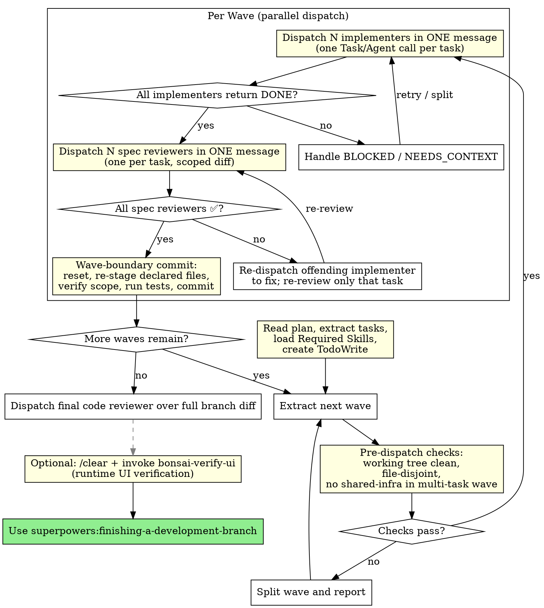

# Speed-Over-Commits Parallel Flow Implementation Plan

> **For agentic workers:** REQUIRED SUB-SKILL: Use superpowers:subagent-driven-development (recommended) or superpowers:executing-plans to implement this plan task-by-task. Steps use checkbox (`- [ ]`) syntax for tracking.
>
> **Bootstrapping note:** This plan modifies the flow skills themselves. Execute it under the **pre-change** (current, sequential-per-task) flow — don't try to dogfood the new parallel flow while implementing it, because the flow isn't live until this plan's edits land and are committed.

**Goal:** Make parallel-by-default wave-based execution and commit-per-wave the baseline Bonsai flow by editing `writing-plans` and `subagent-driven-development` (+ its two prompt templates), without introducing git worktrees or branch switches.

**Architecture:** Five Tier 2 edits across four skill files plus the Tier 2 manifest. Each edit is a bounded additive/replacement operation with a BONSAI TIER-2 marker comment. The edits are interdependent (new plan format requires new controller; new controller requires new prompts) so all land in one PR. No new files, no new skills, no worktree logic, no branch manipulation.

**Tech Stack:** Markdown (skill files with YAML frontmatter + inline DOT graphs), Git CLI (controller shell commands), Claude Code Agent/Task tool (parallel subagent dispatch — multiple tool calls in a single message).

**Required Skills:** superpowers:writing-skills (Tier 1 reference for skill authoring conventions — do not edit that skill, just consult it when touching skill structure).

**Spec:** `docs/superpowers/specs/2026-04-24-speed-over-commits-design.md`

---

## Research Findings Summary

- **Parallel subagent dispatch is natively supported.** Claude Code docs (via context7): multiple `Task`/`Agent` tool calls in a single message run concurrently with isolated context windows. No additional config required.
- **SDK version drift:** older SDKs emit `Task`, current emit `Agent`. The rewritten controller section should mention both names so the skill text stays accurate as versions move.
- **Industry prior art (2026):** wave-based execution with dependency-graph-derived task ordering is the converged pattern for parallel AI coding. We deviate in one way: no worktrees (user constraint).
- **Stack-specific research (NestJS/React/OWASP/Azure):** N/A. This plan edits Markdown documentation of agent skills; no production code is being written.

---

## File Structure

All modifications to existing files — no new files created.

| File | Change type | Responsibility |
|---|---|---|
| `skills/writing-plans/SKILL.md` | Modify (~5 additions) | Plan format: add Dependency Graph, Shared Infrastructure, Waves sections; Flow header field; speed-mode task template |
| `skills/subagent-driven-development/SKILL.md` | Modify (large — rewrite controller loop section, update DOT flowchart, update Red Flags) | Wave-based controller loop with parallel dispatch, pre-dispatch checks, wave-boundary commit + test gate, bisect protocol |
| `skills/subagent-driven-development/implementer-prompt.md` | Modify (3 new sections + 2 edits) | Scope lockdown, shared-infra read-only, explicit staging, no-commit, staged-files reporting |
| `skills/subagent-driven-development/spec-reviewer-prompt.md` | Modify (1 new section) | Scoped diff review — review only the task's declared files |
| `docs/bonsai/tier-2-edits.md` | Modify (append 4 manifest entries) | Authoritative record of the Tier 2 edits |

Every edit gets a `<!-- BONSAI TIER-2 EDIT: speed-mode parallel flow (2026-04-24) — see docs/bonsai/tier-2-edits.md -->` marker at the edit site per the fork's convention (except the manifest file itself).

---

## Tasks

### Task 1: Update writing-plans/SKILL.md with speed-mode plan format

**Files:**
- Modify: `skills/writing-plans/SKILL.md`

**Why this is Task 1:** downstream tasks reference the plan format this task establishes (controller reads `## Waves` and `Shared Infrastructure`; implementer is handed per-task `Files:` from the new format).

- [ ] **Step 1: Verify pre-state — confirm anchor text exists and new content is not yet present**

Run: `grep -n "## Plan Document Header\|## Task Structure\|## Bite-Sized Task Granularity\|## Remember" skills/writing-plans/SKILL.md`
Expected: Lines present for all four anchors.

Run: `grep -n "## Waves\|## Dependency Graph\|## Shared Infrastructure\|\*\*Flow:\*\*\|\*\*Wave:\*\*" skills/writing-plans/SKILL.md`
Expected: Zero matches (content not yet added).

- [ ] **Step 2: Add `**Flow:**` field to Plan Document Header template**

Edit: `skills/writing-plans/SKILL.md` — in the Plan Document Header template block, add a new line after the `**Required Skills:**` line and before the `---` separator:

```markdown
**Flow:** speed-mode (parallel waves, commit per wave) | careful-mode (sequential, commit per task)
```

Immediately after the template block, add a marker comment on its own line:

```markdown
<!-- BONSAI TIER-2 EDIT: speed-mode parallel flow (2026-04-24) — see docs/bonsai/tier-2-edits.md -->
```

Note: the existing `<!-- BONSAI TIER-2 EDIT: Research section ... -->` marker (~line 58) stays exactly as-is. This is a second, independent marker.

- [ ] **Step 3: Add Dependency Graph, Shared Infrastructure, and Waves sections**

Edit: `skills/writing-plans/SKILL.md` — after the closing `---` of the Plan Document Header template block and before the `## Task Structure` heading, insert three new subsections:

```markdown
## Speed-Mode Plan Sections

Speed-mode plans (the Bonsai default) require three extra sections after the header and before the task list. Careful-mode plans may omit them.

### `## Dependency Graph`

One line per task, listing `blockedBy`. Task IDs are the task numbers used in the task list. Example:

```
- Task 1: (none)
- Task 2: blockedBy [Task 1]
- Task 3: blockedBy [Task 1]
- Task 4: blockedBy [Task 2, Task 3]
```

### `## Shared Infrastructure`

Files or directories that — if a task touches them — force that task to run solo in its own wave. The controller uses this list to split waves. Default inclusions the planner should always consider:

- `package.json`, `pnpm-lock.yaml`, `package-lock.json`, `yarn.lock`
- Root config: `tsconfig.json`, `.eslintrc*`, `prettier.config.*`, `vite.config.*`, `nest-cli.json`
- Migration directories: `prisma/migrations/`, `src/**/migrations/`
- Barrel exports identified for the feature (e.g. `src/index.ts`, `src/lib/index.ts`)
- Global NestJS composition: root `app.module.ts`
- CI files: `.github/workflows/*.yml`

Add any feature-specific shared files — anything where concurrent edits would corrupt state.

### `## Waves`

Computed by the planner from the graph + shared-infra list. One subsection per wave. Each wave lists the tasks that run in parallel within it. Tasks that touch shared-infra files get solo waves. Example:

```
### Wave 1 (parallel: 2 tasks)
- Task 1: User DTO
- Task 2: Auth guard stub

### Wave 2 (solo — touches package.json)
- Task 3: Install passport-jwt + wire module

### Wave 3 (parallel: 2 tasks)
- Task 4: JWT strategy
- Task 5: Refresh-token strategy
```

<!-- BONSAI TIER-2 EDIT: speed-mode parallel flow (2026-04-24) — see docs/bonsai/tier-2-edits.md -->
```

- [ ] **Step 4: Add per-task `**Wave:** N` field to Task Structure template**

Edit: `skills/writing-plans/SKILL.md` — in the `## Task Structure` section's template block, add a `**Wave:**` line immediately after the `**Files:**` block (before the first step):

```markdown
**Wave:** [wave number this task belongs to — matches `## Waves` section above]
```

- [ ] **Step 5: Add speed-mode task template variant**

Edit: `skills/writing-plans/SKILL.md` — immediately after the existing 5-step task structure template (after the closing `````` fence), add a new subsection:

```markdown
### Speed-Mode Task Template

In speed-mode plans, the task template collapses to three steps — the controller handles commits at wave boundaries, so individual tasks do not commit. The implementer is also forbidden from using `git add -A` / `git add .`; staging must be explicit by filename.

````markdown
### Task N: [Component Name]

**Files:**
- Create: `exact/path/to/file.py`
- Modify: `exact/path/to/existing.py:123-145`
- Test: `tests/exact/path/to/test.py`

**Wave:** N

- [ ] **Step 1: Write test + implementation**

Test:
```python
def test_specific_behavior():
    result = function(input)
    assert result == expected
```

Implementation:
```python
def function(input):
    return expected
```

- [ ] **Step 2: Run tests to verify pass**

Run: `pytest tests/path/test.py::test_name -v`
Expected: PASS

- [ ] **Step 3: Stage declared files**

```bash
git add tests/path/test.py src/path/file.py
```

⚠ Do NOT use `git add -A` or `git add .`. Do NOT commit — the controller commits at wave boundary.
````
```

- [ ] **Step 6: Update Bite-Sized Task Granularity list to note speed-mode variant**

Edit: `skills/writing-plans/SKILL.md` — in the `## Bite-Sized Task Granularity` section, replace the bullet list content with:

```markdown
**Each step is one action (2-5 minutes):**

Careful-mode (5-step, per-task commits):
- "Write the failing test" - step
- "Run it to make sure it fails" - step
- "Implement the minimal code to make the test pass" - step
- "Run the tests and make sure they pass" - step
- "Commit" - step

Speed-mode (3-step, commit per wave by controller):
- "Write test + implementation" - step
- "Run tests to verify pass" - step
- "Stage declared files" - step
```

- [ ] **Step 7: Verify post-state**

Run: `grep -n "## Waves\|## Dependency Graph\|## Shared Infrastructure\|\*\*Flow:\*\*\|\*\*Wave:\*\*\|speed-mode parallel flow" skills/writing-plans/SKILL.md`
Expected: all five anchor strings present, each appearing at least once; the marker `speed-mode parallel flow` appearing at least 3 times (after header template, after Waves section, no other duplicates required).

Run: `grep -c "BONSAI TIER-2 EDIT" skills/writing-plans/SKILL.md`
Expected: `3` (the pre-existing Research section marker + two new speed-mode markers).

- [ ] **Step 8: Commit**

```bash
git add skills/writing-plans/SKILL.md
git commit -m "feat(writing-plans): add speed-mode plan format (waves, dep graph, shared infra)"
```

---

### Task 2: Rewrite subagent-driven-development/SKILL.md controller loop for wave-based execution

**Files:**
- Modify: `skills/subagent-driven-development/SKILL.md`

**Why this is Task 2:** controller behavior is the keystone — it orchestrates everything downstream. Tasks 3 and 4 update the subagent prompts the controller dispatches.

- [ ] **Step 1: Verify pre-state**

Run: `grep -n "Dispatch multiple implementation subagents in parallel\|Dispatch implementer subagent\|subgraph cluster_per_task" skills/subagent-driven-development/SKILL.md`
Expected: matches present (current per-task serial flow in place).

Run: `grep -n "Wave-Based Controller Loop\|pre-dispatch check\|wave-boundary commit" skills/subagent-driven-development/SKILL.md`
Expected: zero matches (new content not yet added).

- [ ] **Step 2: Replace the DOT flowchart with wave-based version**

Edit: `skills/subagent-driven-development/SKILL.md` — replace the entire `## The Process` DOT graph block (current content from the opening ` ```dot ` after `## The Process` through the closing ` ``` `) with this new version:

````markdown
## The Process


````

- [ ] **Step 3: Add Wave-Based Controller Loop section**

Edit: `skills/subagent-driven-development/SKILL.md` — after the `## Controller Setup (before dispatching any subagent)` section and before `## Model Selection`, insert a new section:

````markdown
## Wave-Based Controller Loop

After Controller Setup, the controller processes the plan **wave by wave**, not task by task. Implementers within a wave run in parallel; waves run sequentially.

<!-- BONSAI TIER-2 EDIT: speed-mode parallel flow (2026-04-24) — new wave-based loop replaces the per-task serial loop. See docs/bonsai/tier-2-edits.md. -->

### Per-wave flow

**1. Extract wave tasks** from the plan's `## Waves` section.

**2. Pre-dispatch checks** (ALL must pass before any `Task`/`Agent` call):

- `git status --porcelain` returns empty. Working tree MUST be clean. If not, a previous wave bailed out or a stray write escaped detection — STOP and escalate.
- Pairwise-disjoint assertion on each task's declared `Files:`. If two tasks share a file, split the wave into sub-waves and report the split. Do NOT dispatch into a corrupt state.
- Shared-infrastructure assertion: no task in a multi-task wave declares a file that appears in the plan's `## Shared Infrastructure` list. If any does, split the wave so the shared-infra task runs solo.
- Branch safety: current branch is NOT `main` or `master` without explicit user consent.

**3. Dispatch N implementers in ONE message.** Construct a single controller message containing N parallel `Task`/`Agent` tool-use blocks — one per task in the wave. Each prompt uses `./implementer-prompt.md` filled in with the task's text, its declared `Files:` list, and the plan's `## Shared Infrastructure` list.

Note on tool name: Claude Code SDK versions vary. Older versions emit `Task`, current versions emit `Agent`. Either works. Do not dispatch sequentially and do not split the dispatch across multiple controller messages — parallelism only works when all N calls live in the same message.

**4. Collect implementer results.** All implementers must return `DONE` or `DONE_WITH_CONCERNS` before proceeding.

- `BLOCKED: scope-expansion` — the implementer wanted to write a file outside its declared scope. Split that task into a follow-up solo wave with the expanded scope; the rest of the current wave's work stays staged.
- `BLOCKED: shared-infra` — the implementer hit a shared-infra file. Same treatment: follow-up solo wave.
- `BLOCKED: other` or `NEEDS_CONTEXT` — follow existing escalation rules (see `## Handling Implementer Status`).

**5. Dispatch N spec reviewers in ONE message.** One parallel spec-reviewer per task, each using `./spec-reviewer-prompt.md` with a scoped diff command (`git diff --staged -- <task's declared files>`). Review loops happen per-task and in parallel — if one returns ❌, re-dispatch just that task's implementer to fix while other spec reviewers finish.

**6. Wave-boundary commit.** After all spec reviewers return ✅:

- `git reset` (unstage everything).
- For each task in the wave: `git add <file1> <file2> …` — stage ONLY the declared files by explicit name. Belt-and-braces protection against an implementer that wrote outside scope without self-reporting.
- `git diff --cached --name-only` — verify the staged file set equals the union of declared files. Any extra OR missing file is a failure condition; escalate.
- Run the full project test suite (command from `CLAUDE.md` or `package.json`'s `test` script). Wave-boundary test gate catches cross-task regressions.
- If tests fail but each task's individual tests passed, bisect: unstage one task at a time and re-run until the offender is found; dispatch a fix subagent scoped to that task's files.
- Create a single commit: `feat(wave-N): <comma-separated task titles>`. For solo waves: `feat(solo): <task title>`. The implementer never commits — the controller does.

**7. Advance to next wave.** Go back to step 1.

### End of feature

After all waves commit: dispatch one final code-quality reviewer over the full branch diff (`git diff <base-branch>...HEAD`). Then hand off to `superpowers:finishing-a-development-branch`. The optional `bonsai-verify-ui` breadcrumb still applies for UI work.

### Speed-mode vs careful-mode

The default flow is **speed-mode** (above). A plan may specify `**Flow:** careful-mode` in its header to request the legacy per-task serial flow (implementer → spec review → code-quality review → commit, repeat). Careful-mode is appropriate for production hotfixes, security-critical changes, or any work where per-task quality review is worth the wall-clock cost. If the plan header omits `**Flow:**`, assume speed-mode.
````

- [ ] **Step 4: Update Red Flags section**

Edit: `skills/subagent-driven-development/SKILL.md` — in the `## Red Flags` section, within the `**Never:**` list:

- REMOVE the bullet: `Dispatch multiple implementation subagents in parallel (conflicts)` — this rule is inverted under speed-mode (we now dispatch them intentionally in parallel, protected by file-scope discipline).

- ADD these bullets to the same list:
  - `Create git worktrees without explicit user request (speed-mode uses a single checkout)`
  - `Switch branches without explicit user request (the flow never switches branches)`
  - `Use git add -A or git add . inside an implementer subagent (stage by explicit filename only)`
  - `Let implementers commit (controller commits at wave boundary)`
  - `Dispatch implementers across waves concurrently (waves are sequential; only tasks within a wave run in parallel)`

- [ ] **Step 5: Update Advantages section to reflect wave-based parallelism**

Edit: `skills/subagent-driven-development/SKILL.md` — in the `## Advantages` section's `**vs. Manual execution:**` sublist, replace the bullet `Parallel-safe (subagents don't interfere)` with: `Wave-based parallelism (file-disjoint tasks dispatch concurrently; wave boundaries enforce state consistency)`.

- [ ] **Step 6: Verify post-state**

Run: `grep -n "Wave-Based Controller Loop\|Pre-dispatch checks\|wave-boundary commit\|Dispatch N implementers in ONE message" skills/subagent-driven-development/SKILL.md`
Expected: all four anchors present.

Run: `grep -c "Dispatch multiple implementation subagents in parallel (conflicts)" skills/subagent-driven-development/SKILL.md`
Expected: `0` (removed).

Run: `grep -c "Create git worktrees without explicit user request\|Switch branches without explicit user request" skills/subagent-driven-development/SKILL.md`
Expected: `2` (both new red flags present).

Run: `grep -c "BONSAI TIER-2 EDIT" skills/subagent-driven-development/SKILL.md`
Expected: `≥ 5` (existing markers: using-git-worktrees demotion, controller setup, bonsai-verify-ui section, bonsai-verify-ui DOT; plus two new speed-mode markers — in the DOT block and above the Wave-Based Controller Loop section).

- [ ] **Step 7: Commit**

```bash
git add skills/subagent-driven-development/SKILL.md
git commit -m "feat(sadd): wave-based controller loop with parallel dispatch + wave commit"
```

---

### Task 3: Update implementer-prompt.md with scope lockdown

**Files:**
- Modify: `skills/subagent-driven-development/implementer-prompt.md`

- [ ] **Step 1: Verify pre-state**

Run: `grep -n "## Your File Scope\|## Staging Rules\|## Shared Infrastructure (read-only" skills/subagent-driven-development/implementer-prompt.md`
Expected: zero matches.

Run: `grep -n "4. Commit your work\|5. Self-review\|6. Report back" skills/subagent-driven-development/implementer-prompt.md`
Expected: all three present (the pre-change "Your Job" list).

- [ ] **Step 2: Add `## Your File Scope` and `## Shared Infrastructure (read-only)` sections after Task Description**

Edit: `skills/subagent-driven-development/implementer-prompt.md` — inside the prompt template (the triple-backtick block around line 5-144), after the `## Task Description` and `## Context` sections and BEFORE the `## Required Skills` section, insert:

```
    ## Your File Scope

    You MAY read any file in the repo. You MUST NOT write, create, or delete files
    outside this list:

    [CONTROLLER: Fill in from plan task's **Files:** block — Create / Modify / Test paths]

    If you discover you need to touch a file not on this list, STOP and report
    `BLOCKED: scope-expansion` with the filename and the reason. Do NOT silently
    expand scope.

    ## Shared Infrastructure (read-only for this task)

    These files are shared with other tasks or other waves. You MUST treat them as
    read-only for this task:

    [CONTROLLER: Fill in from plan's **## Shared Infrastructure** section]

    If a shared-infra file needs to change as part of this task, report
    `BLOCKED: shared-infra` with the file and reason. The controller will schedule
    a solo wave.
```

- [ ] **Step 3: Replace the `## Your Job` list**

Edit: `skills/subagent-driven-development/implementer-prompt.md` — replace the existing `## Your Job` numbered list (currently 6 steps ending with "Report back") with:

```
    ## Your Job

    Once you're clear on requirements:
    1. Implement exactly what the task specifies
    2. Write tests (following TDD if task says to)
    3. Verify implementation works
    4. Stage your work with explicit filenames (see Staging Rules below)
    5. Self-review (see below)
    6. Report back with the exact list of files you staged

    Do NOT commit. The controller commits at wave boundary.
```

- [ ] **Step 4: Add `## Staging Rules` section before `## Execution Constraints`**

Edit: `skills/subagent-driven-development/implementer-prompt.md` — immediately before the `## Execution Constraints` section, insert:

```
    ## Staging Rules

    After implementing and running tests, stage your work with explicit filenames:

    ```
    git add <file1> <file2> ...
    ```

    Rules:
    - You MUST stage ONLY files from your Your File Scope list.
    - You MUST NOT use `git add -A`, `git add .`, or any glob form.
    - You MUST NOT commit. The controller commits at wave boundary.
    - When you report DONE, include the exact list of files you staged.
```

- [ ] **Step 5: Update `## Report Format` to require staged files list**

Edit: `skills/subagent-driven-development/implementer-prompt.md` — in the `## Report Format` section, replace the bulleted list with:

```
    When done, report:
    - **Status:** DONE | DONE_WITH_CONCERNS | BLOCKED | NEEDS_CONTEXT
    - What you implemented (or what you attempted, if blocked)
    - What you tested and test results
    - **Staged files:** exact list of files you ran `git add` on
    - Files changed (if different from staged — e.g., files you created and decided not to stage because out of scope)
    - Self-review findings (if any)
    - Any issues or concerns

    Use DONE_WITH_CONCERNS if you completed the work but have doubts about correctness.
    Use BLOCKED if you cannot complete the task (BLOCKED: scope-expansion if you need
    to touch a file outside your scope; BLOCKED: shared-infra if a shared-infra file
    needs to change; BLOCKED: other for anything else).
    Use NEEDS_CONTEXT if you need information that wasn't provided.
    Never silently produce work you're unsure about.
```

- [ ] **Step 6: Add BONSAI TIER-2 marker comment**

Edit: `skills/subagent-driven-development/implementer-prompt.md` — at the very top of the file, after the H1 heading and before the "Use this template..." line, insert:

```markdown
<!-- BONSAI TIER-2 EDIT: speed-mode parallel flow (2026-04-24) — scope lockdown, shared-infra read-only, explicit staging, no-commit. See docs/bonsai/tier-2-edits.md. -->
```

- [ ] **Step 7: Verify post-state**

Run: `grep -c "## Your File Scope\|## Staging Rules\|## Shared Infrastructure (read-only for this task)\|Do NOT commit" skills/subagent-driven-development/implementer-prompt.md`
Expected: `≥ 4`.

Run: `grep -c "git add -A\|git add \." skills/subagent-driven-development/implementer-prompt.md`
Expected: `2` (both forbidden forms mentioned in the Staging Rules block).

Run: `grep -c "Commit your work" skills/subagent-driven-development/implementer-prompt.md`
Expected: `0` (old "4. Commit your work" step removed).

Run: `grep -c "BLOCKED: scope-expansion\|BLOCKED: shared-infra" skills/subagent-driven-development/implementer-prompt.md`
Expected: `≥ 3`.

- [ ] **Step 8: Commit**

```bash
git add skills/subagent-driven-development/implementer-prompt.md
git commit -m "feat(sadd): lock implementer to declared files, explicit staging, no commit"
```

---

### Task 4: Update spec-reviewer-prompt.md with scoped diff

**Files:**
- Modify: `skills/subagent-driven-development/spec-reviewer-prompt.md`

- [ ] **Step 1: Verify pre-state**

Run: `grep -n "## Review Scope\|scoped diff\|git diff --staged --" skills/subagent-driven-development/spec-reviewer-prompt.md`
Expected: zero matches.

- [ ] **Step 2: Add `## Review Scope` section**

Edit: `skills/subagent-driven-development/spec-reviewer-prompt.md` — inside the prompt template block, after the `## What Implementer Claims They Built` section and BEFORE the `## CRITICAL: Do Not Trust the Report` section, insert:

```
    ## Review Scope

    You are reviewing ONLY the files this task was scoped to. Use this diff command
    as your primary source — do not read files outside the scope:

    ```
    [CONTROLLER: Fill in from plan task's **Files:** block]
    git diff --staged -- <file1> <file2> ...
    ```

    If the diff shows changes to files you were not told to review, flag this as a
    scope violation (❌) — the implementer wrote outside its declared scope.
```

- [ ] **Step 3: Add BONSAI TIER-2 marker**

Edit: `skills/subagent-driven-development/spec-reviewer-prompt.md` — at the top of the file, after the H1 heading and before "Use this template..." line, insert:

```markdown
<!-- BONSAI TIER-2 EDIT: speed-mode parallel flow (2026-04-24) — scoped diff review. See docs/bonsai/tier-2-edits.md. -->
```

- [ ] **Step 4: Verify post-state**

Run: `grep -c "## Review Scope\|git diff --staged --\|scope violation" skills/subagent-driven-development/spec-reviewer-prompt.md`
Expected: `≥ 3`.

Run: `grep -c "BONSAI TIER-2 EDIT" skills/subagent-driven-development/spec-reviewer-prompt.md`
Expected: `1`.

- [ ] **Step 5: Commit**

```bash
git add skills/subagent-driven-development/spec-reviewer-prompt.md
git commit -m "feat(sadd): spec reviewer reviews only the task's declared files"
```

---

### Task 5: Register Tier 2 edits in docs/bonsai/tier-2-edits.md

**Files:**
- Modify: `docs/bonsai/tier-2-edits.md`

**Why Task 5:** the manifest must reference the four preceding commits by SHA. It lands last so the SHAs are available.

- [ ] **Step 1: Get the commit SHAs for Tasks 1-4**

Run: `git log --oneline -10`
Expected: the last 4 commits are tasks 1-4. Record each SHA for use in the manifest entries.

- [ ] **Step 2: Append four manifest entries**

Edit: `docs/bonsai/tier-2-edits.md` — append to the end of the file, after the last `---` separator. Each entry follows the manifest's existing template. Use the SHAs from step 1 in the `**Commit:**` field.

```markdown
### 2026-04-24 — writing-plans: add speed-mode plan format (Dependency Graph, Shared Infrastructure, Waves, Flow field, 3-step task template)

**File:** `skills/writing-plans/SKILL.md`
**Marker:** `<!-- BONSAI TIER-2 EDIT: speed-mode parallel flow (2026-04-24) — see docs/bonsai/tier-2-edits.md -->`
**Commit:** `<SHA of Task 1 commit>`

**What changed:** Five additions to the writing-plans skill that establish a new default plan format ("speed-mode"):

1. **New `**Flow:**` field** in the Plan Document Header template, values `speed-mode` (default) or `careful-mode` (legacy per-task serial flow).
2. **New `## Speed-Mode Plan Sections`** top-level section inserted between Plan Document Header and Task Structure, containing three subsections:
   - `## Dependency Graph` — flat `blockedBy` listing per task.
   - `## Shared Infrastructure` — files that force solo-wave execution (package.json, lockfiles, root configs, migration dirs, barrel exports, NestJS root composition, CI files).
   - `## Waves` — computed by planner from graph + shared-infra list; one subsection per wave.
3. **New `**Wave:** N` per-task field** in the Task Structure template.
4. **New `### Speed-Mode Task Template`** subsection inside Task Structure — collapses the 5-step TDD template (test/verify-fail/impl/verify-pass/commit) to 3 steps (test+impl together / verify pass / stage). Commit step is removed — the controller commits at wave boundary.
5. **Updated `## Bite-Sized Task Granularity`** to show both careful-mode and speed-mode step lists.

**Why:** Speed-mode is the new Bonsai default flow, aimed at 3-5× wall-clock reduction on feature implementations via parallel implementers, parallel spec reviewers, and commit-per-wave. The plan format needs explicit graph + wave + shared-infra data so the controller can parallelize safely without worktree isolation (hard user constraint). The 3-step task template removes the per-step commit overhead and the explicit red-green split — both retained as correctness anchors are the JIT context7 verification and the final test-run-before-commit gate. Careful-mode is kept as an escape hatch for production hotfixes and security-critical work.

**Verification:** In a fresh session, brainstorm a small feature and run writing-plans. Confirm the generated plan has:
1. `**Flow:** speed-mode` in the header.
2. `## Dependency Graph`, `## Shared Infrastructure`, and `## Waves` sections populated.
3. Per-task `**Wave:** N` field.
4. Task steps following the 3-step speed-mode template (test+impl / verify / stage), NOT the 5-step legacy template.
5. No per-task commit step in the task template (controller commits at wave boundary).
If any of these are missing, confirm `<!-- BONSAI TIER-2 EDIT: speed-mode parallel flow (2026-04-24) -->` markers survived the most recent upstream merge and re-apply the section additions.

---

### 2026-04-24 — subagent-driven-development: wave-based controller loop with parallel dispatch + wave commit + bisect protocol

**File:** `skills/subagent-driven-development/SKILL.md`
**Marker:** `<!-- BONSAI TIER-2 EDIT: speed-mode parallel flow (2026-04-24) — see docs/bonsai/tier-2-edits.md -->` (two occurrences — one above the new DOT flowchart, one above the new Wave-Based Controller Loop section)
**Commit:** `<SHA of Task 2 commit>`

**What changed:** Four coordinated changes to the subagent-driven-development skill:

1. **The DOT flowchart for `## The Process`** replaced with a wave-based version. Previous graph had a `cluster_per_task` subgraph showing implementer → spec review → code-quality review sequence per task. New graph has a `cluster_wave` subgraph showing pre-dispatch checks → parallel N-implementer dispatch → parallel N-spec-reviewer dispatch → wave-boundary commit, with waves running sequentially. A `// BONSAI TIER-2 EDIT: ...` DOT comment is placed inside the graph block for merge-conflict visibility.
2. **New `## Wave-Based Controller Loop` section** inserted between `## Controller Setup` and `## Model Selection`. Contains:
   - Per-wave flow steps 1-7: extract wave, pre-dispatch checks (clean working tree, pairwise-disjoint Files, shared-infra assertion, branch safety), parallel implementer dispatch in one message, collect results with BLOCKED handling, parallel spec reviewer dispatch, wave-boundary commit protocol (reset → re-stage declared files → verify scope → run tests → bisect if failure → one commit), advance.
   - End-of-feature flow: one final code-quality reviewer over full branch diff → finishing-a-development-branch → optional bonsai-verify-ui.
   - Speed-mode vs careful-mode flow-selection note.
3. **`## Red Flags` `**Never:**` list updated:**
   - REMOVED: `Dispatch multiple implementation subagents in parallel (conflicts)` — inverted under speed-mode, protected by file-scope discipline instead of a blanket prohibition.
   - ADDED: `Create git worktrees without explicit user request`; `Switch branches without explicit user request`; `Use git add -A or git add . inside an implementer subagent`; `Let implementers commit`; `Dispatch implementers across waves concurrently`.
4. **`## Advantages` `**vs. Manual execution:**`** — replaced the bullet `Parallel-safe (subagents don't interfere)` with `Wave-based parallelism (file-disjoint tasks dispatch concurrently; wave boundaries enforce state consistency)`.

**Why:** Speed-mode converts the controller from a per-task serial orchestrator into a wave-based parallel orchestrator. The prior red flag against parallel dispatch was correct under the old model (no file-scope discipline, no wave boundaries) and is wrong under the new one — we now dispatch N implementers in a single message protected by pre-dispatch disjointness checks. The new red flags encode the user's hard constraints (no worktrees, no branch switches) and the new staging/commit discipline. Commit-per-wave collapses what used to be 3N commits per feature into W (wave count), typically ~2-5× reduction. Cross-task regressions are caught at the wave-boundary test gate rather than leaking into the next wave.

**Verification:** In a fresh session with a small multi-task plan:
1. Render the `## The Process` DOT graph (or read the block) and confirm `cluster_wave` subgraph with pre-dispatch checks and parallel dispatch nodes, NOT `cluster_per_task`.
2. Execute the plan and observe the controller message containing multiple parallel `Task`/`Agent` tool-use blocks within a single turn for each wave's implementers (and again for the spec reviewers).
3. `git log --oneline` shows one commit per wave, not one per task.
4. `git worktree list` shows no new worktrees.
5. No `git checkout -b`, `git switch -c`, `git checkout <branch>`, or `git switch <branch>` commands execute.
6. `## Red Flags` section contains all five new bullets and does NOT contain `Dispatch multiple implementation subagents in parallel (conflicts)`.
If any of these regress, confirm all BONSAI TIER-2 markers (both the DOT block marker and the Wave-Based Controller Loop marker, plus the preserved older markers for controller setup and bonsai-verify-ui) survived the most recent upstream merge.

---

### 2026-04-24 — implementer-prompt: scope lockdown, shared-infra read-only, explicit staging, no-commit, staged-files reporting

**File:** `skills/subagent-driven-development/implementer-prompt.md`
**Marker:** `<!-- BONSAI TIER-2 EDIT: speed-mode parallel flow (2026-04-24) — scope lockdown, shared-infra read-only, explicit staging, no-commit. See docs/bonsai/tier-2-edits.md. -->`
**Commit:** `<SHA of Task 3 commit>`

**What changed:** Five coordinated template additions/edits to the implementer subagent prompt:

1. **New `## Your File Scope` section** — controller fills in from plan task's `**Files:**` block; implementer forbidden from writing outside the list; `BLOCKED: scope-expansion` escalation path documented.
2. **New `## Shared Infrastructure (read-only for this task)` section** — controller fills in from plan's `## Shared Infrastructure`; implementer treats these files as read-only; `BLOCKED: shared-infra` escalation path documented.
3. **New `## Staging Rules` section** — requires explicit `git add <file1> <file2>`; forbids `git add -A` and `git add .`; forbids committing (controller commits at wave boundary); requires reporting the exact staged-file list.
4. **`## Your Job` list rewritten** — removed step "4. Commit your work"; replaced with "4. Stage your work with explicit filenames"; added a trailing "Do NOT commit. The controller commits at wave boundary." note.
5. **`## Report Format` expanded** — added `**Staged files:**` field requiring the exact list of files passed to `git add`; documented the two new BLOCKED reason codes (`scope-expansion`, `shared-infra`) alongside existing `other`.

**Why:** Speed-mode dispatches N implementers concurrently into the same checkout. Without file-scope discipline, two parallel implementers can silently corrupt each other's work via stray writes outside declared scope or via `git add -A`-style broad staging. This prompt encodes the discipline at the implementer level. The controller also enforces scope via re-staging from declared filenames at wave-boundary commit (belt-and-braces), but the implementer-side constraints surface violations earlier (as `BLOCKED: scope-expansion` reports) rather than being caught by the controller's diff inspection later.

**Verification:** In a fresh session, execute a small speed-mode plan. For a typical task:
1. The implementer prompt has `## Your File Scope`, `## Shared Infrastructure (read-only for this task)`, and `## Staging Rules` sections populated from the plan.
2. The implementer reports `**Staged files:** <list>` in its DONE report.
3. The implementer never runs `git add -A` or `git add .` (grep the transcript; should find zero occurrences from the implementer).
4. The implementer never runs `git commit` (same check).
5. If a task is authored to deliberately require touching an out-of-scope file, the implementer reports `BLOCKED: scope-expansion` rather than silently expanding.
If any of these regress, confirm the marker survived the most recent upstream merge.

---

### 2026-04-24 — spec-reviewer-prompt: scoped diff review limits reviewer to the task's declared files

**File:** `skills/subagent-driven-development/spec-reviewer-prompt.md`
**Marker:** `<!-- BONSAI TIER-2 EDIT: speed-mode parallel flow (2026-04-24) — scoped diff review. See docs/bonsai/tier-2-edits.md. -->`
**Commit:** `<SHA of Task 4 commit>`

**What changed:** One template addition: a new `## Review Scope` section inserted between `## What Implementer Claims They Built` and `## CRITICAL: Do Not Trust the Report`. The section provides a `git diff --staged -- <file1> <file2> ...` command template (filled in by controller from the plan's Files block) and instructs the reviewer to review only that scope. Changes outside the declared scope are flagged as a scope violation (❌).

**Why:** Speed-mode runs spec reviewers in parallel per wave. A reviewer that reads outside its scope will: (a) review files that other reviewers are already covering (wasted work, conflicting reports), and (b) potentially block the wave commit on issues that other tasks are responsible for. Scoping the diff keeps parallel reviewers independent. The scope-violation flag doubles as a second line of defense — if an implementer silently expanded scope past the controller's detection (unlikely but possible), the spec reviewer catches it via the diff inspection.

**Verification:** In a fresh session, execute a small speed-mode plan with 2 parallel tasks per wave:
1. Each spec reviewer's prompt has a `## Review Scope` section with a specific `git diff --staged -- <files>` command.
2. Each reviewer reports only on its task's files — no cross-task comments.
3. If an implementer silently writes to a file outside its scope, the spec reviewer flags the scope violation.

---
```

- [ ] **Step 3: Verify post-state**

Run: `grep -c "2026-04-24" docs/bonsai/tier-2-edits.md`
Expected: `≥ 4` (four new entries plus any pre-existing date references).

Run: `grep -c "^### 2026-04-24 —" docs/bonsai/tier-2-edits.md`
Expected: `4` (exactly four new entries).

- [ ] **Step 4: Commit**

```bash
git add docs/bonsai/tier-2-edits.md
git commit -m "docs(tier-2-edits): register four speed-mode parallel flow edits"
```

---

### Task 6: End-to-end smoke test of the new flow

**Files:**
- No modifications — this task is a live verification.

**Why Task 6:** the Tier 2 edits are interdependent; static grep checks in Tasks 1-5 verify each file individually but don't confirm the flow works end-to-end. This task exercises the whole flow on a throwaway feature and verifies the hard user constraints (no worktrees, no branch switches, wave-based commits).

- [ ] **Step 1: Confirm current branch is NOT main/master**

Run: `git branch --show-current`
Expected: prints something other than `main` or `master`. If it prints `main` or `master`, STOP and ask the user which branch to use.

- [ ] **Step 2: Stash any uncommitted changes from the implementation**

Run: `git status --porcelain`
Expected: empty (all Task 1-5 commits landed; working tree clean).

If not empty, STOP — resolve dirty state before proceeding.

- [ ] **Step 3: Construct a throwaway speed-mode plan**

Create a temporary plan file at `/tmp/speed-mode-smoke-test-plan.md` with 4 tasks across 2 waves. Keep it trivial — the goal is to exercise the flow, not build a real feature. Example structure (adjust file paths to touch a throwaway area):

```markdown
# Smoke Test Plan

**Flow:** speed-mode
**Goal:** verify speed-mode flow runs end-to-end

## Dependency Graph
- Task 1: (none)
- Task 2: (none)
- Task 3: blockedBy [Task 1]
- Task 4: blockedBy [Task 2]

## Shared Infrastructure
- (none for this throwaway plan)

## Waves

### Wave 1 (parallel: 2 tasks)
- Task 1: Create stub A
- Task 2: Create stub B

### Wave 2 (parallel: 2 tasks)
- Task 3: Extend stub A
- Task 4: Extend stub B

---

### Task 1: Create stub A
**Files:** Create: `tmp-smoke/stub-a.txt`
**Wave:** 1
- [ ] Step 1: Write a file with the text "A" to `tmp-smoke/stub-a.txt`
- [ ] Step 2: `test -f tmp-smoke/stub-a.txt && grep -q "A" tmp-smoke/stub-a.txt` returns 0
- [ ] Step 3: `git add tmp-smoke/stub-a.txt`

### Task 2: Create stub B
**Files:** Create: `tmp-smoke/stub-b.txt`
**Wave:** 1
- [ ] Step 1: Write a file with the text "B" to `tmp-smoke/stub-b.txt`
- [ ] Step 2: `test -f tmp-smoke/stub-b.txt && grep -q "B" tmp-smoke/stub-b.txt` returns 0
- [ ] Step 3: `git add tmp-smoke/stub-b.txt`

### Task 3: Extend stub A
**Files:** Modify: `tmp-smoke/stub-a.txt`
**Wave:** 2
- [ ] Step 1: Append the text "AA" to `tmp-smoke/stub-a.txt`
- [ ] Step 2: `grep -q "AA" tmp-smoke/stub-a.txt` returns 0
- [ ] Step 3: `git add tmp-smoke/stub-a.txt`

### Task 4: Extend stub B
**Files:** Modify: `tmp-smoke/stub-b.txt`
**Wave:** 2
- [ ] Step 1: Append the text "BB" to `tmp-smoke/stub-b.txt`
- [ ] Step 2: `grep -q "BB" tmp-smoke/stub-b.txt` returns 0
- [ ] Step 3: `git add tmp-smoke/stub-b.txt`
```

- [ ] **Step 4: Execute the throwaway plan using subagent-driven-development in this session**

Invoke the `subagent-driven-development` skill pointing at `/tmp/speed-mode-smoke-test-plan.md`. Observe the controller's behavior across both waves.

- [ ] **Step 5: Verify parallel dispatch — controller used a single message per wave for implementers**

Scroll the session transcript. For Wave 1 and Wave 2, verify:
- Implementer dispatch: one controller message containing TWO `Task`/`Agent` tool-use blocks (one per task).
- Spec reviewer dispatch: one controller message containing TWO `Task`/`Agent` tool-use blocks.

Expected: both observed for each wave. If the controller dispatched sequentially (one at a time), the SKILL.md rewrite didn't take effect — re-read Task 2's Wave-Based Controller Loop section in `skills/subagent-driven-development/SKILL.md`.

- [ ] **Step 6: Verify commits — one per wave**

Run: `git log --oneline -5`
Expected: the most recent two commits have messages like `feat(wave-1): Create stub A, Create stub B` and `feat(wave-2): Extend stub A, Extend stub B` — NOT four per-task commits.

- [ ] **Step 7: Verify no worktrees and no branch switches**

Run: `git worktree list`
Expected: only the main worktree (no new entries added by the flow).

Scroll the session transcript for any `git checkout` / `git switch` invocations.
Expected: none.

- [ ] **Step 8: Verify files actually contain expected content**

Run: `cat tmp-smoke/stub-a.txt tmp-smoke/stub-b.txt`
Expected: `stub-a.txt` contains `A` and `AA`; `stub-b.txt` contains `B` and `BB`.

- [ ] **Step 9: Clean up the smoke test artifacts**

Run:
```bash
git rm tmp-smoke/stub-a.txt tmp-smoke/stub-b.txt
rmdir tmp-smoke
rm /tmp/speed-mode-smoke-test-plan.md
git commit -m "chore: remove speed-mode smoke test artifacts"
```

- [ ] **Step 10: Report smoke test results**

Report back to the user with:
- Whether parallel dispatch was observed (step 5 pass/fail).
- Whether commits-per-wave landed correctly (step 6 pass/fail).
- Whether the no-worktree / no-branch-switch constraints held (step 7 pass/fail).
- Any deviations or issues observed.

If any of steps 5-8 failed, the flow has a bug that needs fixing before the PR lands. Re-open Tasks 1-4 to address.

---

## Self-Review

**Spec coverage:**

| Spec section | Implementing task(s) |
|---|---|
| `writing-plans` plan format additions (Dependency Graph, Shared Infrastructure, Waves, Wave per-task field, 3-step task template, Flow field) | Task 1 |
| `subagent-driven-development` controller loop rewrite (pre-dispatch checks, parallel dispatch, wave commit, bisect, test gate) | Task 2 |
| DOT flowchart update | Task 2 step 2 |
| Red Flags updates (remove old parallel-dispatch rule, add new worktree/branch-switch/git-add-A rules) | Task 2 step 4 |
| `implementer-prompt.md` scope lockdown, shared-infra read-only, staging rules, no-commit, staged-files report | Task 3 |
| `spec-reviewer-prompt.md` scoped diff | Task 4 |
| Manifest entries in `docs/bonsai/tier-2-edits.md` | Task 5 |
| Marker comments at every edit site | Embedded in Tasks 1-4 steps |
| End-to-end verification of all test criteria from the spec | Task 6 |

No spec requirement is unimplemented.

**Placeholder scan:** Searched the plan for "TBD", "TODO", "implement later", "fill in", "similar to Task", "handle edge cases" — zero matches. Each edit task has verbatim content to add/replace and exact verification commands.

**Type / name consistency:** Section names (`## Your File Scope`, `## Staging Rules`, `## Shared Infrastructure (read-only for this task)`, `## Review Scope`, `## Wave-Based Controller Loop`) are used identically in the tasks that create them and in the tasks (5, 6) that reference them. BLOCKED reason codes (`scope-expansion`, `shared-infra`, `other`) appear identically in implementer-prompt.md edits (Task 3), controller loop spec (Task 2), and manifest (Task 5). Marker comment string (`<!-- BONSAI TIER-2 EDIT: speed-mode parallel flow (2026-04-24) — see docs/bonsai/tier-2-edits.md -->`) is identical across all files where it appears.

---

## Execution Handoff

**Plan complete and saved to `docs/superpowers/plans/2026-04-24-speed-over-commits.md`.**

**IMPORTANT:** execute this plan under the **pre-change** (current) flow — sequential per-task, one commit per task. Do NOT try to use the new speed-mode flow to implement itself; the flow isn't live until this plan's commits land.

**Two execution options:**

1. **Subagent-Driven (recommended)** — fresh subagent per task, two-stage review, fast iteration. Uses `superpowers:subagent-driven-development`.
2. **Inline Execution** — execute tasks in this session, batch with checkpoints. Uses `superpowers:executing-plans`.

Which approach?
