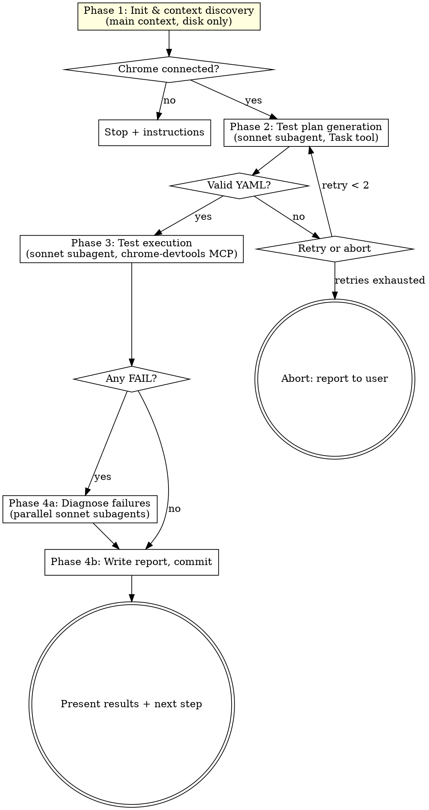

# bonsai-verify-ui

Runtime UI verification for work completed by `superpowers:subagent-driven-development`. Runs
in a fresh `/clear`ed session, reads spec + plan + git diff from disk, spawns a Sonnet subagent
to generate a YAML test plan, spawns a second Sonnet subagent to execute the plan via Chrome
DevTools MCP, diagnoses failures via parallel Sonnet subagents, and writes a report to
`docs/superpowers/verify/`.

**Core principle:** fresh session + disk-only inputs + single-subagent browser control =
verification that is independent of whatever the implementer believed they built. The browser
must be driven by exactly one agent — during Phase 3 this is a Sonnet subagent, during Phase 1
it is the main orchestrator for the one-shot connection precheck — to avoid parallel-agent
contention documented in Chrome's 2026 multi-agent guidance.

**No auto-fix.** Verification exposes problems and diagnoses root causes. The human decides the
next step (debug manually, re-dispatch to a fix pass, revert).

**Parallel-browser variant (optional, not assumed).** This skill defaults to one browser on the
`chrome-devtools` MCP server. Some setups additionally configure separate per-agent servers
(`chrome-1`..`chrome-N`, each its own Chrome profile) so multiple agents can drive their own
browser concurrently. Do NOT assume these exist: only use them if `mcp__chrome-N__*` tools are
actually available, otherwise stay single-browser on `chrome-devtools`. The two are opposite
answers to the same contention problem (serialize vs. isolate). Setup and config for the
per-agent servers live in the SOP at `sop/05-build/07-ai-tooling/parallel-chrome-devtools-mcp.md`
(repo `BonsaiSoftware/bonsai-software-sop`).

## When to Use

- After `superpowers:subagent-driven-development` completes its final code reviewer pass and
  the user `/clear`s the session, before `superpowers:finishing-a-development-branch`
- User says "verify work", "verify this branch", "runtime test the UI", "verify UI"
- The feature branch has a web UI that can be opened in Chrome

**When NOT to use:**
- Backend-only changes with no user-observable UI
- Pure refactors with no behavior change
- Docs-only or config-only edits
- Static verification (typecheck, lint, tests) — those ran during subagent-driven-development
- When the dev server isn't running or Chrome DevTools MCP isn't configured

## Skill References

- `test-planner-agent.md` — protocol for the sonnet test-planner subagent
- `chrome-devtools-execution-patterns.md` — assertion-type → MCP tool lookup table

Both files are read at runtime by Sonnet subagents:
- `test-planner-agent.md` is passed to the Phase 2 planner subagent via `<files_to_read>`
- `chrome-devtools-execution-patterns.md` is passed to the Phase 3 executor subagent via
  `<files_to_read>`

## The Process



## Phase 1: Init & Context Discovery

Runs entirely in the main orchestrator context using Bash, Read, Grep, Glob, and
`mcp__chrome-devtools__list_pages`.

1. **Branch check.** Run `git branch --show-current`. If the result is `main` or `master`, stop
   and tell the user to run the skill from the feature branch the implementation landed on.
   Never verify on the main branch.

2. **Commit range.** Run `git log main..HEAD --name-only --pretty=format:'%H%n%s%n%b%n---'`.
   Parse into `{sha, subject, body, files[]}` records.

3. **Plan/spec grep.** Across all commit subjects and bodies, regex-match
   `docs/superpowers/plans/[^ ]+\.md` and `docs/superpowers/specs/[^ ]+-design\.md`. Collect
   unique matches.

4. **Resolve ambiguity.**
   - Zero matches → fall back to "ask mode"
   - Exactly one match of each → proceed with those paths
   - Multiple matches → fall back to "ask mode"

5. **Ask fallback (only if needed).** Use `AskUserQuestion`. Build candidates:
   - `Glob('docs/superpowers/plans/*.md')` sorted by mtime descending, top 5
   - `Glob('docs/superpowers/specs/*-design.md')` sorted by mtime descending, top 5
   Present as a single multi-choice question with `{spec_path, plan_path}` pairs. User picks one.

6. **Read artifacts into context:**
   - Read the full text of `{spec_path}` and `{plan_path}`
   - Read `./CLAUDE.md` if it exists
   - Run `git diff main...HEAD --stat` and parse the file list

7. **Base URL detection.** Scan the plan body and `CLAUDE.md` for `localhost:\d+` patterns. Take
   the most frequent match. Default to `http://localhost:3000` if none found. Print one line
   to the user: `"Detected base URL: {url}. Press enter to accept or type a different URL."`
   Wait for the response and use whatever the user says.

8. **Chrome connection precheck.** Call `mcp__chrome-devtools__list_pages`:
   - **Pages returned, one matches `base_url`** → call `mcp__chrome-devtools__select_page` with
     that page's id
   - **Pages returned, none match** → call `mcp__chrome-devtools__new_page` with `url=base_url`
   - **Empty list or MCP error** → stop execution and print:
     ```
     Chrome DevTools MCP not connected. To proceed:
       1. Start your dev server (npm run dev / pnpm dev)
       2. Start Chrome with: chrome --remote-debugging-port=9222
       3. Re-run this skill in this same session
     ```
     Do not proceed without a connection.

**Output of Phase 1:** in-memory context object:
```
{ branch, spec_path, plan_path, changed_files, commit_range, base_url,
  connected_page_id }
```

Nothing is written to disk in Phase 1.

## Phase 2: Test Plan Generation

Spawn one sonnet subagent via the `Task` tool. The subagent reads the test planner protocol,
the spec, the plan, and `CLAUDE.md`, explores the source tree for changed files, and returns
a `<test_plan>` YAML block. The subagent has no chrome-devtools access — it only reads files
and returns YAML.

**Dispatch prompt:**

```
Task tool (general-purpose):
  description: "Generate runtime test plan for bonsai-verify-ui"
  model: sonnet
  prompt: |
    <objective>
    Explore what was built on branch {branch} and generate a <test_plan> YAML block for
    Chrome DevTools runtime testing. Return ONLY the YAML block, no prose.
    </objective>

    <agent_instructions>
    Read and follow the test planner protocol:
    skills/bonsai-verify-ui/test-planner-agent.md
    </agent_instructions>

    <context>
    Branch: {branch}
    Spec:   {spec_path}
    Plan:   {plan_path}
    Base URL: {base_url}
    Changed files (from git diff):
      {list of paths, one per line}
    </context>

    <files_to_read>
    - skills/bonsai-verify-ui/test-planner-agent.md
    - {spec_path}
    - {plan_path}
    - ./CLAUDE.md  (skip if not present)
    </files_to_read>
```

**Parse and validate the returned `<test_plan>` block.** Reject with retry if:

- The YAML is syntactically invalid
- Any test is missing `id`, `name`, `url`, `requires_auth`, or `assertions`
- Any assertion is missing `type` or `expected`
- Any URL contains `http://` or `https://` (must be relative)
- Any selector uses `nth-child`, XPath, or CSS-module hash patterns
- Any file in `<context>.changed_files` is absent from both `tests[].url`/selector references
  and `untestable_files`

On retry (max 2), re-dispatch the subagent with an appended note explaining what failed. After
two retries, warn the user and offer: `proceed with partial plan`, `switch to interactive mode
where user describes tests`, `abort`.

## Phase 3: Test Execution

Dispatch **one** Sonnet subagent via the `Task` tool. The subagent owns Chrome DevTools MCP
for the full duration of test execution — it is the sole browser driver during this phase. The
main orchestrator makes **zero** `mcp__chrome-devtools__*` calls while the subagent runs.

**Why a Sonnet subagent instead of main context:**
- Test execution is mechanical (navigate, assert, record) and well-specified by the patterns
  file. Sonnet handles deterministic loop execution reliably at lower cost than keeping Opus
  in the loop for hundreds of tool calls.
- Chrome DevTools MCP does not tolerate concurrent drivers. Exactly one agent holds the
  browser at a time, so parallel dispatch is not an option for this phase.
- The subagent's inputs are pass-by-value (test plan + patterns file + connected page id) —
  no shared conversation state is needed.

**Dispatch prompt:**

```
Task tool (general-purpose):
  description: "Execute runtime test plan via Chrome DevTools MCP"
  model: sonnet
  prompt: |
    <objective>
    Execute every test in the <test_plan> block against the connected Chrome
    browser using mcp__chrome-devtools__* tools. Return exactly one
    <test_results> YAML block — no prose, no markdown outside the block.
    </objective>

    <agent_instructions>
    Read skills/bonsai-verify-ui/chrome-devtools-execution-patterns.md FIRST.
    It is the authoritative lookup table for every tool call, assertion type,
    setup action, evidence collection step, and error-recovery path you need.
    Do not improvise outside it.

    Start by calling mcp__chrome-devtools__select_page with connected_page_id.
    If that fails, call mcp__chrome-devtools__new_page with base_url. If both
    fail, return the results YAML with every test marked SKIP (skip_reason
    "chrome disconnected") and stopped_early: true.

    Execute tests sequentially in the given order. Never parallelize tool
    calls — the browser is single-threaded. After each test, print ONE
    progress line to stdout:

      Test {i}/{N}: {name} — {PASS|FAIL|SKIP}

    Do not diagnose, fix, or retry failures beyond the retry rules in the
    patterns file (Error Recovery section). Record the facts. Move on.
    </agent_instructions>

    <context>
    base_url: {base_url}
    connected_page_id: {connected_page_id}
    </context>

    <files_to_read>
    - skills/bonsai-verify-ui/chrome-devtools-execution-patterns.md
    </files_to_read>

    <test_plan>
    {verbatim YAML block from Phase 2, including the <test_plan> tags}
    </test_plan>

    <output_format>
    Return exactly one block:

    <test_results>
    auth_setup_status: PASS | FAIL | N/A
    stopped_early: false
    stopped_reason: null
    tests:
      - id: 1
        name: "…"
        url: "…"
        status: PASS | FAIL | SKIP
        skip_reason: "…"              # required if SKIP
        assertions:
          - type: element_exists
            selector: "…"
            expected: "…"
            actual: "…"
            status: PASS | FAIL
        evidence_uri: "screenshot://…"
        console_errors:               # only if FAIL
          - "…"
        failed_requests:              # only if FAIL
          - method: GET
            url: "…"
            status: 500
            message: "…"
    </test_results>
    </output_format>
```

**Parse and validate the returned `<test_results>` block.** Retry once (re-dispatch with
the parse error appended to the prompt) if the YAML is invalid or the top-level `tests` list
is missing. If the retry also fails, reconstruct best-effort results from whatever progress
lines the subagent printed — mark any unreported test SKIP with reason
`"executor returned malformed results"` — and proceed to Phase 4. Do not block the report on a
bad serialization.

**Early termination.** If the returned YAML has `stopped_early: true`, surface the reason to
the user:

```
⚠ Test execution stopped early: {stopped_reason}
   Restart the dev server / Chrome and re-run this skill to continue.
```

Do not automatically re-dispatch — dev-server state changes are user-visible actions.

**Error recovery, console noise filter, and the per-test execution loop** are all defined in
`chrome-devtools-execution-patterns.md`. The subagent follows them. The main orchestrator does
not intervene during execution, does not second-guess pass/fail calls, and does not ignore
hydration warnings, `console.error` from app code, or failed `fetch` responses when merging
results.

## Phase 4: Report & Failure Diagnosis

### 4a. Diagnose failures (only if any test FAILED)

For each FAIL test, dispatch a sonnet subagent **in parallel** via a single message with
multiple `Task` calls. Parallel dispatch is required — N failing tests must not serialize.

**Diagnosis subagent prompt:**

```
Task tool (general-purpose):
  description: "Diagnose failure: {test.name}"
  model: sonnet
  prompt: |
    Diagnose the root cause of this test failure. You must NOT implement the fix — only
    identify what's wrong and where. Return exactly these fields as YAML:

      root_cause: one concise sentence
      affected_files:
        - path: file.ts
          line: 42
      suggested_fix: one concise sentence describing the human fix approach

    Test: {test.name}
    URL: {test.url}
    Expected: {test.expected}
    Failed assertions: {details}
    Console errors: {list}
    Failed network requests: {list}

    Context:
    - Spec: {spec_path}
    - Plan: {plan_path}
    - Changed files on this branch: {list}

    Start by reading the spec and plan to understand intent, then read the changed files
    referenced in the failure to identify the root cause.
```

Merge each subagent's return values into the corresponding test entry. If a diagnosis subagent
returns unstructured output, record `root_cause: "diagnosis failed, see raw output"` and save
the raw response — do not block the report on a bad diagnosis.

### 4b. Write report

**Report path:** `docs/superpowers/verify/YYYY-MM-DD-<topic>-verify.md`

**Topic derivation:**
1. Take the plan basename without `.md` (e.g., `2026-04-15-user-auth`)
2. Strip any leading `YYYY-MM-DD-` date prefix (e.g., `user-auth`)
3. That's the topic

Create the `docs/superpowers/verify/` directory if it doesn't exist.

**Report structure:**

```markdown
---
status: complete
branch: {branch}
spec: {spec_path}
plan: {plan_path}
started: {ISO timestamp of Phase 1 start}
updated: {ISO timestamp now}
---

## Summary

total: {N}  passed: {N}  failed: {N}  skipped: {N}

## Coverage

changed_files: {count from git diff}
covered_files: {count}
untestable_files:
  - path: {path}
    reason: {reason}

## Tests

### 1. {Test Name}
- **url:** {url}
- **expected:** {description}
- **result:** pass
- **evidence:** Screenshot resource URI from take_screenshot

### 2. {Failing Test Name}
- **url:** {url}
- **expected:** {description}
- **result:** fail
- **failed_assertions:**
  - type: {type}
    selector: {selector}
    expected: {expected}
    actual: {actual}
- **console_errors:**
  - {each error on its own line}
- **failed_requests:**
  - {method} {url} → {status} {message}
- **evidence:** Screenshot resource URI
- **root_cause:** {from diagnosis subagent}
- **affected_files:**
  - {path}:{line}
- **suggested_fix:** {one-line approach}

### 3. {Skipped Test Name}

- **url:** {test url}
- **expected:** {description}
- **result:** skipped
- **reason:** {why — e.g., "depends on test #N which failed", "auth setup failed", "stopped after 3 consecutive failures"}
```

### 4c. Commit the report

```bash
git add docs/superpowers/verify/{report_file}.md
git commit -m "verify: runtime UI verification for {topic}"
```

Do not skip hooks. Do not amend. Do not force-push.

### 4d. Present to user

Print a concise table:

```
## Verification Complete — {topic}

Runtime tests: {passed}/{total} passed

| # | Test | Result | Details |
|---|------|--------|---------|
| 1 | {name} | PASS | — |
| 2 | {name} | FAIL | {root cause} |
| 3 | {name} | SKIP | depends on #2 |

Report: docs/superpowers/verify/{file}.md
```

**All pass:**
```
✅ All tests passed. Ready to finish the branch.

Next: invoke superpowers:finishing-a-development-branch
```

**Any fail:**
```
⚠ {N} test(s) failed. Root causes diagnosed in the report.

Next steps (your choice):
- /clear + superpowers:systematic-debugging — dig into a specific failure
- /clear + superpowers:subagent-driven-development — hand the report to a fix pass
- Read the report and fix manually
```

## Red Flags

**Never:**
- Run this skill from `main` or `master` branch
- Proceed if Chrome DevTools MCP is not connected
- Dispatch multiple subagents that all need chrome-devtools access. Exactly one Sonnet
  subagent drives the browser during Phase 3. Phase 4a diagnosis subagents read files only —
  no chrome-devtools tools.
- Have the main orchestrator make `mcp__chrome-devtools__*` calls during Phase 3 execution
  (other than the Phase 1 connection precheck, and only if the user explicitly retries after
  early termination). The Phase 3 subagent is the browser driver.
- Auto-fix failures (the skill diagnoses, the human decides)
- Amend or force-push the report commit
- Ignore hydration warnings or `console.error` from app code in the noise filter
- Skip the coverage audit — every changed file must be covered or justifiably untestable

## Integration

**Upstream:**
- `superpowers:subagent-driven-development` — implementation flow that hands off to this skill
  via an optional "Optional Runtime Verification" section after its final code reviewer approves

**Downstream:**
- `superpowers:finishing-a-development-branch` — next step after all tests pass
- `superpowers:systematic-debugging` — next step for investigating a specific failure
- `superpowers:subagent-driven-development` — rerun in a fix pass if the diagnosis surfaces
  fix-plan-worthy work
