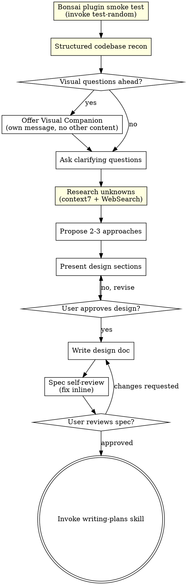

# Brainstorming Ideas Into Designs

Help turn ideas into fully formed designs and specs through natural collaborative dialogue.

Start by understanding the current project context, then ask questions one at a time to refine the idea. Once you understand what you're building, present the design and get user approval.

<HARD-GATE>
Do NOT invoke any implementation skill, write any code, scaffold any project, or take any implementation action until you have presented a design and the user has approved it. This applies to EVERY project regardless of perceived simplicity.
</HARD-GATE>

## Anti-Pattern: "This Is Too Simple To Need A Design"

Every project goes through this process. A todo list, a single-function utility, a config change — all of them. "Simple" projects are where unexamined assumptions cause the most wasted work. The design can be short (a few sentences for truly simple projects), but you MUST present it and get approval.

## Checklist

You MUST create a task for each of these items and complete them in order:

1. **Bonsai plugin smoke test** — invoke the `test-random` skill and confirm it returns the expected test string. This verifies the bonsaipowers plugin is loaded and skill discovery is working before any real brainstorming begins. If the smoke test fails, stop and tell the user the plugin is broken.
2. **Structured codebase recon** — check files, docs, recent commits, AND do a targeted scan: grep `package.json` (or equivalent manifest) for existing libraries, scan the nearest `CLAUDE.md` for project conventions, find the most similar existing feature and read how it's structured. Any approach you later propose must fit what's already there — proposing "use Redux" when the repo is Zustand wastes everyone's time.
3. **Offer visual companion** (if topic will involve visual questions) — this is its own message, not combined with a clarifying question. See the Visual Companion section below.
4. **Ask clarifying questions** — one at a time, understand purpose/constraints/success criteria
5. **Research unknowns** — this step is mandatory for any brainstorm that involves external libraries, APIs, cloud services, or framework features. Skip ONLY for pure internal refactors or config-only tweaks with zero external dependencies. Two external checks, both required:
   - **Feasibility spot-checks via context7** — at least one query required. Verify that the API/library behavior your approach depends on actually exists in the current version. One query per uncertain question, yes/no granularity. Example: *"Does NestJS support WebSocket handlers with guards on the same decorator?"* — one query, binary answer, move on. Do NOT use context7 for implementation details; that's what writing-plans is for. If you believe you can skip context7 entirely, you are almost certainly wrong — your training data is stale, verify anyway.
   - **Prior-art scan via WebSearch** — at least one query required, more if the problem has several distinct decision points. Your training data is stale and frequently misses approaches teams have converged on in the last 12–18 months. Frame each query around current practice or tradeoffs between named approaches — one query per independent question is the right granularity, so run as many as the brainstorm needs. Example: *"How do teams typically implement multi-tenant row-level security in Postgres 16 in 2026?"* — returns approaches to compare in your proposal. If you believe you can skip WebSearch entirely because "I already know the prior art," you are almost certainly wrong — verify anyway.
6. **Propose 2-3 approaches** — with trade-offs and your recommendation. Research from step 5 should show up here: approaches that failed a feasibility check are off the table, approaches surfaced by prior-art are on it. **Azure-native preference:** when the feature involves cloud infrastructure, storage, auth, messaging, or any service that Azure provides natively (e.g. Azure Service Bus over self-hosted RabbitMQ, Azure Blob Storage over S3, Entra ID over custom auth), always include the Azure-native option and recommend it unless there is a concrete technical reason not to.
7. **Present design** — in sections scaled to their complexity, get user approval after each section
8. **Write design doc** — save to `docs/superpowers/specs/YYYY-MM-DD-<topic>-design.md` and commit
9. **Spec self-review** — quick inline check for placeholders, contradictions, ambiguity, scope (see below)
10. **User reviews written spec** — ask user to review the spec file before proceeding
11. **Transition to implementation** — invoke writing-plans skill to create implementation plan

<!-- BONSAI TIER-2 EDIT: Step 1 (smoke test), step 2 (structured codebase recon additions), step 5 (research unknowns via context7 + WebSearch with HARD-GATE on BOTH tools), and step 6 (Azure-native preference in approach proposals) are team-specific additions not in upstream. On upstream merge, ensure these steps survive and the numbering stays consistent (upstream has no step 1 and no step 5; its steps 1-9 map to our 2-4, 6-11 with step 2 upgraded). The Research unknowns process section also has a HARD-GATE requiring at least one context7 query AND at least one WebSearch query — preserve both. -->

## Process Flow

**The terminal state is invoking writing-plans.** Do NOT invoke frontend-design, mcp-builder, or any other implementation skill. The ONLY skill you invoke after brainstorming is writing-plans.

## The Process

**Understanding the idea:**

- Check out the current project state first (files, docs, recent commits)
- Before asking detailed questions, assess scope: if the request describes multiple independent subsystems (e.g., "build a platform with chat, file storage, billing, and analytics"), flag this immediately. Don't spend questions refining details of a project that needs to be decomposed first.
- If the project is too large for a single spec, help the user decompose into sub-projects: what are the independent pieces, how do they relate, what order should they be built? Then brainstorm the first sub-project through the normal design flow. Each sub-project gets its own spec → plan → implementation cycle.
- For appropriately-scoped projects, ask questions one at a time to refine the idea
- Prefer multiple choice questions when possible, but open-ended is fine too
- Only one question per message - if a topic needs more exploration, break it into multiple questions
- Focus on understanding: purpose, constraints, success criteria

**Researching unknowns (before proposing approaches):**

Once you understand the problem but before you propose approaches, do the external research. This step is mandatory for any brainstorm involving external libraries, APIs, cloud services, or framework features. Skip ONLY for pure internal refactors or config-only tweaks with zero external dependencies.

<HARD-GATE>
You MUST run at least one context7 query AND at least one WebSearch query before proposing approaches, unless the brainstorm involves zero external libraries, APIs, or cloud services. "I already know this API" and "I already know the prior art" are both invalid reasons to skip — your training data is stale, verify anyway. If you skip either query, explicitly state why in a single sentence before proceeding to approaches.
</HARD-GATE>

Two tools, two purposes:

- **context7** — for feasibility questions about libraries, APIs, or frameworks. At least one query required. Verify that the API/library behavior your approach depends on actually exists in the current version. One query per uncertain question. Ask at the granularity of "does X support Y?" — not "how do I build a whole feature with X?". Implementation details belong in writing-plans, not brainstorming. If context7 says the behavior exists, move on; if it doesn't, that approach is off the table before you propose it.
- **WebSearch** — at least one query required for prior-art scans, more if the brainstorm has several independent decision points. Your training data is stale and frequently misses approaches teams have converged on in the last 12–18 months; this is not optional just because the problem "feels familiar." Frame each query well — one good query per independent question beats a shotgun, but don't compress unrelated questions into a single vague search to save effort. Example framings: *"how do teams typically do X in [tech] in 2025/2026"*, *"tradeoffs between approach A and approach B for Y"*. Bring what you find into the approach proposal as concrete named approaches to compare. Same rule as context7: if you believe you can skip this, you are almost certainly wrong.

What NOT to research: anything answerable by reading the repo (use the Structured codebase recon step for that); settled best practices you already know well; implementation-level details you'll work out during planning.

**Exploring approaches:**

- Propose 2-3 different approaches with trade-offs
- Present options conversationally with your recommendation and reasoning
- Lead with your recommended option and explain why
- Approaches ruled out in the Research unknowns step should not reappear here; approaches surfaced there should
- **Azure-native preference:** when the feature involves cloud infrastructure, storage, auth, messaging, queuing, or any service that Azure provides natively, always include the Azure-native option and recommend it by default. Examples: Azure Service Bus over self-hosted RabbitMQ, Azure Blob Storage over S3, Entra ID over custom auth, Azure Key Vault over manual secret management. Only recommend a non-Azure alternative when there is a concrete technical reason (cost, feature gap, existing infrastructure lock-in).

**Presenting the design:**

- Once you believe you understand what you're building, present the design
- Scale each section to its complexity: a few sentences if straightforward, up to 200-300 words if nuanced
- Ask after each section whether it looks right so far
- Cover: architecture, components, data flow, error handling, testing
- Be ready to go back and clarify if something doesn't make sense

**Design for isolation and clarity:**

- Break the system into smaller units that each have one clear purpose, communicate through well-defined interfaces, and can be understood and tested independently
- For each unit, you should be able to answer: what does it do, how do you use it, and what does it depend on?
- Can someone understand what a unit does without reading its internals? Can you change the internals without breaking consumers? If not, the boundaries need work.
- Smaller, well-bounded units are also easier for you to work with - you reason better about code you can hold in context at once, and your edits are more reliable when files are focused. When a file grows large, that's often a signal that it's doing too much.

**Working in existing codebases:**

- Explore the current structure before proposing changes. Follow existing patterns.
- Where existing code has problems that affect the work (e.g., a file that's grown too large, unclear boundaries, tangled responsibilities), include targeted improvements as part of the design - the way a good developer improves code they're working in.
- Don't propose unrelated refactoring. Stay focused on what serves the current goal.

## After the Design

**Documentation:**

- Write the validated design (spec) to `docs/superpowers/specs/YYYY-MM-DD-<topic>-design.md`
  - (User preferences for spec location override this default)
- Use elements-of-style:writing-clearly-and-concisely skill if available
- Commit the design document to git

**Spec Self-Review:**
After writing the spec document, look at it with fresh eyes:

1. **Placeholder scan:** Any "TBD", "TODO", incomplete sections, or vague requirements? Fix them.
2. **Internal consistency:** Do any sections contradict each other? Does the architecture match the feature descriptions?
3. **Scope check:** Is this focused enough for a single implementation plan, or does it need decomposition?
4. **Ambiguity check:** Could any requirement be interpreted two different ways? If so, pick one and make it explicit.

Fix any issues inline. No need to re-review — just fix and move on.

**User Review Gate:**
After the spec review loop passes, ask the user to review the written spec before proceeding:

> "Spec written and committed to `<path>`. Please review it and let me know if you want to make any changes before we start writing out the implementation plan."

Wait for the user's response. If they request changes, make them and re-run the spec review loop. Only proceed once the user approves.

**Implementation:**

- Invoke the writing-plans skill to create a detailed implementation plan
- Do NOT invoke any other skill. writing-plans is the next step.

## Key Principles

- **One question at a time** - Don't overwhelm with multiple questions
- **Multiple choice preferred** - Easier to answer than open-ended when possible
- **YAGNI ruthlessly** - Remove unnecessary features from all designs
- **Explore alternatives** - Always propose 2-3 approaches before settling
- **Incremental validation** - Present design, get approval before moving on
- **Be flexible** - Go back and clarify when something doesn't make sense

## Visual Companion

A browser-based companion for showing mockups, diagrams, and visual options during brainstorming. Available as a tool — not a mode. Accepting the companion means it's available for questions that benefit from visual treatment; it does NOT mean every question goes through the browser.

**Offering the companion:** When you anticipate that upcoming questions will involve visual content (mockups, layouts, diagrams), offer it once for consent:
> "Some of what we're working on might be easier to explain if I can show it to you in a web browser. I can put together mockups, diagrams, comparisons, and other visuals as we go. This feature is still new and can be token-intensive. Want to try it? (Requires opening a local URL)"

**This offer MUST be its own message.** Do not combine it with clarifying questions, context summaries, or any other content. The message should contain ONLY the offer above and nothing else. Wait for the user's response before continuing. If they decline, proceed with text-only brainstorming.

**Per-question decision:** Even after the user accepts, decide FOR EACH QUESTION whether to use the browser or the terminal. The test: **would the user understand this better by seeing it than reading it?**

- **Use the browser** for content that IS visual — mockups, wireframes, layout comparisons, architecture diagrams, side-by-side visual designs
- **Use the terminal** for content that is text — requirements questions, conceptual choices, tradeoff lists, A/B/C/D text options, scope decisions

A question about a UI topic is not automatically a visual question. "What does personality mean in this context?" is a conceptual question — use the terminal. "Which wizard layout works better?" is a visual question — use the browser.

If they agree to the companion, read the detailed guide before proceeding:
`skills/brainstorming/visual-companion.md`
