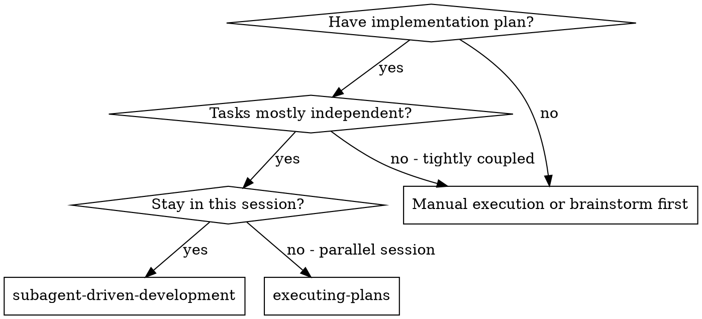
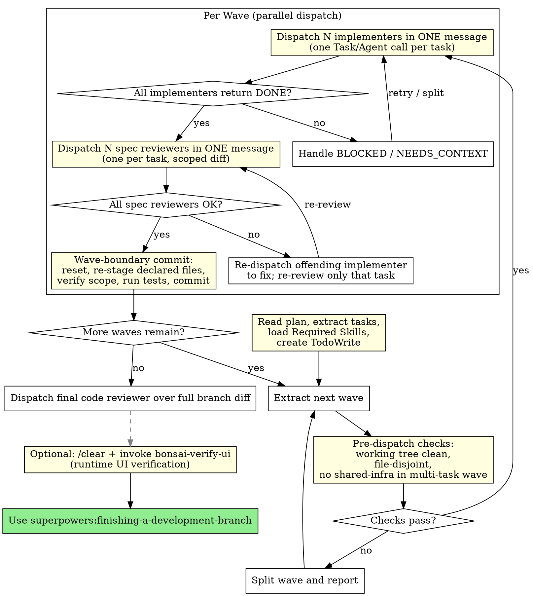

# Subagent-Driven Development

Execute plan by dispatching fresh subagent per task, with two-stage review after each: spec compliance review first, then code quality review.

**Why subagents:** You delegate tasks to specialized agents with isolated context. By precisely crafting their instructions and context, you ensure they stay focused and succeed at their task. They should never inherit your session's context or history — you construct exactly what they need. This also preserves your own context for coordination work.

**Core principle:** Fresh subagent per task + two-stage review (spec then quality) = high quality, fast iteration

## When to Use



**vs. Executing Plans (parallel session):**
- Same session (no context switch)
- Fresh subagent per task (no context pollution)
- Two-stage review after each task: spec compliance first, then code quality
- Faster iteration (no human-in-loop between tasks)

## The Process



## Controller Setup (before dispatching any subagent)

After reading the plan and extracting tasks:

1. **Load required skills** — read `**Required Skills:**` from the plan header and invoke each listed skill (e.g. `nestjs-best-practices`, `owasp-security`). These are active constraints for the entire execution. If a listed skill can't be found, STOP and tell the user.
2. **Include skill names in every implementer prompt** — add a `## Required Skills` section to the implementer dispatch (see template addition below). The implementer subagent loads them itself — it's a fresh agent and doesn't inherit your loaded skills.
3. **Include OWASP constraints in spec reviewer prompts** — when a task has security constraints, add them to the spec reviewer dispatch so the reviewer verifies they were implemented, not just the functional requirements.

The controller is disciplined, not curious. Everything the subagents need should already be in the plan. The only external tool use you authorize for implementers is verifying an API signature — one context7 call, not an investigation.

<!-- BONSAI TIER-2 EDIT: Controller setup section (skill loading + prompt injection), implementer-prompt.md additions (Required Skills, JIT context7, security gates, best-practices compliance), and spec-reviewer-prompt.md addition (OWASP verification) are team-specific additions not in upstream. On upstream merge, ensure all three files keep these additions. -->

## Wave-Based Controller Loop

After Controller Setup, the controller processes the plan **wave by wave**, not task by task. Implementers within a wave run in parallel; waves run sequentially.

<!-- BONSAI TIER-2 EDIT: speed-mode parallel flow (2026-04-24) — new wave-based loop replaces the per-task serial loop. See docs/bonsai/tier-2-edits.md. -->

### Per-wave flow

**1. Extract wave tasks** from the plan's `## Waves` section.

**2. Pre-dispatch checks** (ALL must pass before any `Task`/`Agent` call):

- `git status --porcelain` returns empty. Working tree MUST be clean. If not, a previous wave bailed out or a stray write escaped detection — STOP and escalate.
- Pairwise-disjoint assertion on each task's declared `Files:`. If two tasks share a file, split the wave into sub-waves and report the split. Do NOT dispatch into a corrupt state.
- Shared-infrastructure assertion: no task in a multi-task wave declares a file that appears in the plan's `## Shared Infrastructure` list. If any does, split the wave so the shared-infra task runs solo.
- Branch safety: current branch is NOT `main` or `master` without explicit user consent.

**3. Dispatch N implementers in ONE message.** Construct a single controller message containing N parallel `Task`/`Agent` tool-use blocks — one per task in the wave. Each prompt uses `./implementer-prompt.md` filled in with the task's text, its declared `Files:` list, and the plan's `## Shared Infrastructure` list.

Note on tool name: Claude Code SDK versions vary. Older versions emit `Task`, current versions emit `Agent`. Either works. Do not dispatch sequentially and do not split the dispatch across multiple controller messages — parallelism only works when all N calls live in the same message.

**4. Collect implementer results.** All implementers must return `DONE` or `DONE_WITH_CONCERNS` before proceeding.

- `BLOCKED: scope-expansion` — the implementer wanted to write a file outside its declared scope. Split that task into a follow-up solo wave with the expanded scope; the rest of the current wave's work stays staged.
- `BLOCKED: shared-infra` — the implementer hit a shared-infra file. Same treatment: follow-up solo wave.
- `BLOCKED: other` or `NEEDS_CONTEXT` — follow existing escalation rules (see `## Handling Implementer Status`).

**5. Dispatch N spec reviewers in ONE message.** One parallel spec-reviewer per task, each using `./spec-reviewer-prompt.md` with a scoped diff command (`git diff --staged -- <task's declared files>`). Review loops happen per-task and in parallel — if one returns ❌, re-dispatch just that task's implementer to fix while other spec reviewers finish.

**6. Wave-boundary commit.** After all spec reviewers return ✅:

- `git reset` (unstage everything).
- For each task in the wave: `git add <file1> <file2> …` — stage ONLY the declared files by explicit name. Belt-and-braces protection against an implementer that wrote outside scope without self-reporting.
- `git diff --cached --name-only` — verify the staged file set equals the union of declared files. Any extra OR missing file is a failure condition; escalate.
- Run the full project test suite (command from `CLAUDE.md` or `package.json`'s `test` script). Wave-boundary test gate catches cross-task regressions.
- If tests fail but each task's individual tests passed, bisect: unstage one task at a time and re-run until the offender is found; dispatch a fix subagent scoped to that task's files.
- Create a single commit: `feat(wave-N): <comma-separated task titles>`. For solo waves: `feat(solo): <task title>`. The implementer never commits — the controller does.

**7. Advance to next wave.** Go back to step 1.

### End of feature

After all waves commit: dispatch one final code-quality reviewer over the full branch diff (`git diff <base-branch>...HEAD`). Then hand off to `superpowers:finishing-a-development-branch`. The optional `bonsai-verify-ui` breadcrumb still applies for UI work.

### Speed-mode vs careful-mode

The default flow is **speed-mode** (above). A plan may specify `**Flow:** careful-mode` in its header to request the legacy per-task serial flow (implementer → spec review → code-quality review → commit, repeat). Careful-mode is appropriate for production hotfixes, security-critical changes, or any work where per-task quality review is worth the wall-clock cost. If the plan header omits `**Flow:**`, assume speed-mode.

## Model Selection

Use the least powerful model that can handle each role to conserve cost and increase speed.

**Mechanical implementation tasks** (isolated functions, clear specs, 1-2 files): use a fast, cheap model. Most implementation tasks are mechanical when the plan is well-specified.

**Integration and judgment tasks** (multi-file coordination, pattern matching, debugging): use a standard model.

**Architecture, design, and review tasks**: use the most capable available model.

**Task complexity signals:**
- Touches 1-2 files with a complete spec → cheap model
- Touches multiple files with integration concerns → standard model
- Requires design judgment or broad codebase understanding → most capable model

## Handling Implementer Status

Implementer subagents report one of four statuses. Handle each appropriately:

**DONE:** Proceed to spec compliance review.

**DONE_WITH_CONCERNS:** The implementer completed the work but flagged doubts. Read the concerns before proceeding. If the concerns are about correctness or scope, address them before review. If they're observations (e.g., "this file is getting large"), note them and proceed to review.

**NEEDS_CONTEXT:** The implementer needs information that wasn't provided. Provide the missing context and re-dispatch.

**BLOCKED:** The implementer cannot complete the task. Assess the blocker:
1. If it's a context problem, provide more context and re-dispatch with the same model
2. If the task requires more reasoning, re-dispatch with a more capable model
3. If the task is too large, break it into smaller pieces
4. If the plan itself is wrong, escalate to the human

**Never** ignore an escalation or force the same model to retry without changes. If the implementer said it's stuck, something needs to change.

## Prompt Templates

- `./implementer-prompt.md` - Dispatch implementer subagent
- `./spec-reviewer-prompt.md` - Dispatch spec compliance reviewer subagent
- `./code-quality-reviewer-prompt.md` - Dispatch code quality reviewer subagent

## Example Workflow

```
You: I'm using Subagent-Driven Development to execute this plan.

[Read plan file once: docs/superpowers/plans/feature-plan.md]
[Extract all 5 tasks with full text and context]
[Create TodoWrite with all tasks]

Task 1: Hook installation script

[Get Task 1 text and context (already extracted)]
[Dispatch implementation subagent with full task text + context]

Implementer: "Before I begin - should the hook be installed at user or system level?"

You: "User level (~/.config/superpowers/hooks/)"

Implementer: "Got it. Implementing now..."
[Later] Implementer:
  - Implemented install-hook command
  - Added tests, 5/5 passing
  - Self-review: Found I missed --force flag, added it
  - Committed

[Dispatch spec compliance reviewer]
Spec reviewer: ✅ Spec compliant - all requirements met, nothing extra

[Get git SHAs, dispatch code quality reviewer]
Code reviewer: Strengths: Good test coverage, clean. Issues: None. Approved.

[Mark Task 1 complete]

Task 2: Recovery modes

[Get Task 2 text and context (already extracted)]
[Dispatch implementation subagent with full task text + context]

Implementer: [No questions, proceeds]
Implementer:
  - Added verify/repair modes
  - 8/8 tests passing
  - Self-review: All good
  - Committed

[Dispatch spec compliance reviewer]
Spec reviewer: ❌ Issues:
  - Missing: Progress reporting (spec says "report every 100 items")
  - Extra: Added --json flag (not requested)

[Implementer fixes issues]
Implementer: Removed --json flag, added progress reporting

[Spec reviewer reviews again]
Spec reviewer: ✅ Spec compliant now

[Dispatch code quality reviewer]
Code reviewer: Strengths: Solid. Issues (Important): Magic number (100)

[Implementer fixes]
Implementer: Extracted PROGRESS_INTERVAL constant

[Code reviewer reviews again]
Code reviewer: ✅ Approved

[Mark Task 2 complete]

...

[After all tasks]
[Dispatch final code-reviewer]
Final reviewer: All requirements met, ready to merge

Done!
```

<!-- BONSAI TIER-2 EDIT: "Optional Runtime Verification" section, corresponding DOT flowchart node (dashed edge + lightyellow fill), and Integration "Optional downstream" entry for bonsai-verify-ui. On upstream merge, ensure all three survive. -->

## Optional Runtime Verification (Bonsai)

After the final code reviewer approves and before finishing the branch, you MAY runtime-verify
the UI in a real browser. This is skippable for non-UI work (backend-only, config, docs), but
strongly recommended for any task that touches pages, components, forms, or user-facing flows.

**How:** `/clear` the current session (to drop all accumulated context), then in the fresh
session invoke the `bonsai-verify-ui` skill. It will read the spec, plan, and branch git log,
generate a test plan, execute it via Chrome DevTools MCP, and write a report to
`docs/superpowers/verify/`.

**Why /clear:** the verification runs in a fresh session with only disk state as input. This
avoids context pollution from the implementation flow and keeps the verification independent
of whatever the implementer believed they built.

**When to skip:** backend-only changes with no UI surface, pure refactors, docs-only edits,
config tweaks. Use your judgment — if a user could observe the change in a browser, verify it.

## Advantages

**vs. Manual execution:**
- Subagents follow TDD naturally
- Fresh context per task (no confusion)
- Wave-based parallelism (file-disjoint tasks dispatch concurrently; wave boundaries enforce state consistency)
- Subagent can ask questions (before AND during work)

**vs. Executing Plans:**
- Same session (no handoff)
- Continuous progress (no waiting)
- Review checkpoints automatic

**Efficiency gains:**
- No file reading overhead (controller provides full text)
- Controller curates exactly what context is needed
- Subagent gets complete information upfront
- Questions surfaced before work begins (not after)

**Quality gates:**
- Self-review catches issues before handoff
- Two-stage review: spec compliance, then code quality
- Review loops ensure fixes actually work
- Spec compliance prevents over/under-building
- Code quality ensures implementation is well-built

**Cost:**
- More subagent invocations (implementer + 2 reviewers per task)
- Controller does more prep work (extracting all tasks upfront)
- Review loops add iterations
- But catches issues early (cheaper than debugging later)

## Red Flags

**Never:**
- Start implementation on main/master branch without explicit user consent
- Skip reviews (spec compliance OR code quality)
- Proceed with unfixed issues
- Make subagent read plan file (provide full text instead)
- Skip scene-setting context (subagent needs to understand where task fits)
- Ignore subagent questions (answer before letting them proceed)
- Accept "close enough" on spec compliance (spec reviewer found issues = not done)
- Skip review loops (reviewer found issues = implementer fixes = review again)
- Let implementer self-review replace actual review (both are needed)
- **Start code quality review before spec compliance is ✅** (wrong order)
- Move to next task while either review has open issues
- Create git worktrees without explicit user request (speed-mode uses a single checkout)
- Switch branches without explicit user request (the flow never switches branches)
- Use git add -A or git add . inside an implementer subagent (stage by explicit filename only)
- Let implementers commit (controller commits at wave boundary)
- Dispatch implementers across waves concurrently (waves are sequential; only tasks within a wave run in parallel)

**If subagent asks questions:**
- Answer clearly and completely
- Provide additional context if needed
- Don't rush them into implementation

**If reviewer finds issues:**
- Implementer (same subagent) fixes them
- Reviewer reviews again
- Repeat until approved
- Don't skip the re-review

**If subagent fails task:**
- Dispatch fix subagent with specific instructions
- Don't try to fix manually (context pollution)

## Integration

**Required workflow skills:**
- **superpowers:writing-plans** - Creates the plan this skill executes
- **superpowers:requesting-code-review** - Code review template for reviewer subagents
- **superpowers:finishing-a-development-branch** - Complete development after all tasks

**Optional workflow skills:**
- **superpowers:using-git-worktrees** - Optional: Set up isolated workspace when the task benefits from isolation
<!-- BONSAI TIER-2 EDIT: using-git-worktrees is demoted from REQUIRED to OPTIONAL for this fork (team commonly works on the canonical bonsai-custom branch with no concurrent work to isolate from). In upstream, this bullet sits under "Required workflow skills" with "REQUIRED: Set up isolated workspace before starting". On merge, keep it under "Optional workflow skills". See docs/bonsai/tier-2-edits.md (2026-04-15). -->


**Subagents should use:**
- **superpowers:test-driven-development** - Subagents follow TDD for each task

**Alternative workflow:**
- **superpowers:executing-plans** - Use for parallel session instead of same-session execution

**Optional downstream:**
- **bonsai-verify-ui** - Runtime UI verification in a fresh session after implementation completes. Invoke via /clear + skill trigger after the final code reviewer approves.
